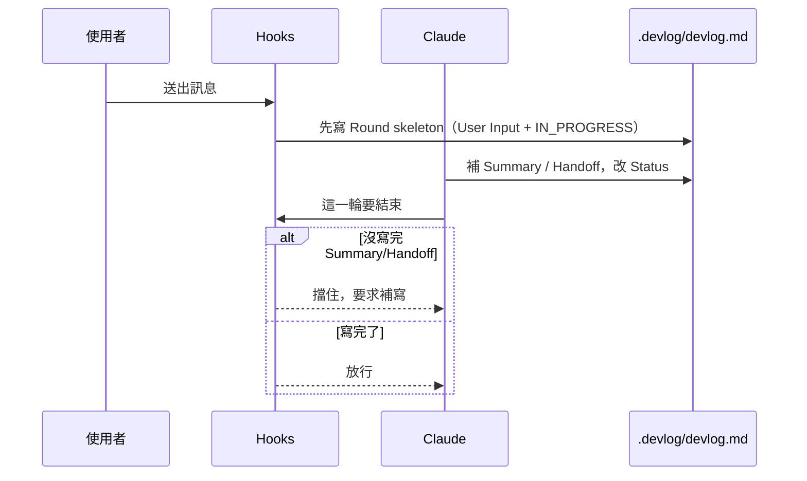

# devlog-tracker

版本 `0.4.0`。在專案中維護一份 `.devlog/devlog.md`，把每一輪對話的請求、決策與結果寫成永久紀錄。
參考 [agfnow/agentflow](https://github.com/agfnow/agentflow) 的 devlog 基礎協定做的簡化版，
只保留「逐輪對話紀錄」這一層。對話一 `/clear` 或換 session 就沒了；這份檔案取代那個缺口，
讓工作可以中斷再接。沒下過 `/devlog-tracker:start` 時，裝著也不會動任何檔案。

## 特色

### 指令

| 指令 | 做什麼 |
|---|---|
| `/devlog-tracker:start` | 建立 `.devlog/.enabled`，從此強制每輪都寫紀錄。不依賴 Claude 自行判斷「值不值得記錄」，也跟任務／plan 是否完成無關。已經啟用過的專案要再跑一次，才會補上 `.segment-state`。讀檔對進度，不自動開工。 |
| `/devlog-tracker:continue` | 讀 `.devlog/devlog.md`，依最後一輪 Handoff 的下一步接著做。`/clear` 之後要接續用這個。細節見 [`docs/design/continue.md`](docs/design/continue.md)。 |
| `/devlog-tracker:pause` | 暫停強制記錄，歷史檔不動，之後可再 `start`。 |
| `/devlog-tracker:compact` | 把舊的 `DONE` 輪次搬到 `devlog.archive.md`。 |
| `/devlog-tracker:keep` | 把有主題的一段搬走成 `devlog.<name>.md`。Claude 會建議範圍與檔名，也可自訂。不是 compact。細節見 [`docs/design/keep.md`](docs/design/keep.md)。 |

### 強制記錄開著之後



每一輪固定四塊：`User Input`（貼近原話，保留彈性）、`Summary`（給人掃）、`Handoff`（給下一輪 Claude：決策／檔案／現況／下一步）、`Status`（`DONE` / `IN_PROGRESS` / `BLOCKED` / `INTERRUPTED`）。讀檔案就能還原對話重點，不用翻對話紀錄。細節見 [`docs/design/summary-handoff.md`](docs/design/summary-handoff.md) 和 SKILL.md。

### hook 會自動做的事

- **自動接續**：`SessionStart` hook 在開新 session、resume、`/compact`、`/fork` 時，把最近幾輪注入 context。`/clear` 是真的清空，不注入；要接續請 `/devlog-tracker:continue`。細節見 [`docs/design/continue.md`](docs/design/continue.md)。
- **意外中斷**：非 usage 的 API 錯誤、SessionEnd、殘留的 `.round-open` 會把開著的 Round 標成 `INTERRUPTED`。usage 用光不算中斷。中途取消（例如 Esc）通常是在**下一則訊息**或**下次 SessionStart（startup / resume / clear / fork）**才補上；`PostToolUseFailure` 的 `is_interrupt` 若有觸發，只是 best-effort，不能當成一定會立刻蓋章。細節見 [`docs/design/recording-moments.md`](docs/design/recording-moments.md)。
- **段落記錄**：長輪不要憋到最後，邊做邊寫 `### 段落`。同一輪連續約 15 分鐘沒改 `devlog.md`，`PreToolUse` hook 會擋住下一個工具，要求先補一段（門檻可調）。細節見 [`docs/design/segment-watch.md`](docs/design/segment-watch.md)。
- **Checkpoint Mode**：累積約 20 輪沒寫跨輪摘要，`Stop` hook 會要求補一段 `## Checkpoint`（門檻可調）。細節見 [`docs/design/checkpoint-mode.md`](docs/design/checkpoint-mode.md)。
- **Span Mode**：`/loop`、Workflow 這類自動續接的長任務，不必每個 tick 都寫完整 Round，用 tick 計數當安全閥；崩潰最多漏記固定數量的 tick，不是整段。細節見 [`docs/design/span-mode.md`](docs/design/span-mode.md)。

## 安裝

作為 Claude Code plugin 安裝（會自動更新）：

```
/plugin marketplace add gogogohuang/devlog-tracker
/plugin install devlog-tracker@devlog-tracker
```

## 使用

在專案裡下一次：

```
/devlog-tracker:start
```

之後正常跟 Claude 對話即可，每一輪結束前都會被強制檢查、補上 `.devlog/devlog.md` 的紀錄。`/clear` 之後 context 是空的；要接著做上一題，下 `/devlog-tracker:continue`。暫停、歸檔、具名搬走見上方指令表（完整 namespace，plugin 名稱是 `devlog-tracker`）。

測試：`bash hooks/scripts/run-tests.sh`

## 目錄結構

```
devlog-tracker/
├── .gitignore
├── .github/workflows/hooks.yml          # 每次 push / PR 執行 hook 自我檢查
├── .claude-plugin/
│   ├── plugin.json        # plugin manifest
│   └── marketplace.json   # 讓這個 repo 本身就是一個 marketplace
├── docs/design/
│   ├── span-mode.md           # Span Mode 設計文件
│   ├── checkpoint-mode.md     # Checkpoint Mode 設計文件
│   ├── segment-watch.md       # 單輪沉默 15 分鐘保底
│   ├── summary-handoff.md     # 每輪 Summary（人）+ Handoff（AI）設計文件
│   ├── recording-moments.md   # 送出時 skeleton、正常收尾、意外 INTERRUPTED
│   ├── continue.md            # /clear 不注入，/continue 才讀檔接續
│   └── keep.md                # 具名搬走成 devlog.<name>.md
├── skills/devlog-tracker/SKILL.md
├── hooks/
│   ├── hooks.json                       # SessionStart / UserPromptSubmit / PreToolUse / Stop / StopFailure / SessionEnd / PostToolUseFailure
│   └── scripts/
│       ├── session-start-devlog.sh      # 自動接續（clear 不注入；含 Span Mode 恢復提醒、殘留 .round-open 補 INTERRUPTED）
│       ├── round-start.sh               # 送出時寫 Round skeleton、拍雜湊，遞增 Span/Checkpoint 計數，重設 Segment Watch 計時
│       ├── close-open-round.sh          # 把開著的 Round 標成 INTERRUPTED（共用 helper）
│       ├── on-stop-failure.sh           # StopFailure：非 usage 錯誤標中斷
│       ├── on-session-end.sh            # SessionEnd：殘留 round 標中斷
│       ├── on-tool-failure.sh           # PostToolUseFailure：工具失敗時標中斷
│       ├── segment-watch.sh             # 同一輪太久沒寫 devlog 就擋住下一個工具
│       ├── enforce-devlog.sh            # 強制每輪結束前要寫 Summary/Handoff（含 Span Mode、Checkpoint Mode 檢查）
│       ├── run-tests.sh                  # 執行所有 test-*.sh
│       ├── test-close-open-round.sh     # close-open-round 自我檢查
│       ├── test-round-start.sh          # round-start skeleton / heal 自我檢查
│       ├── test-on-interrupt.sh         # StopFailure / SessionEnd / PostToolUseFailure 自我檢查
│       ├── test-enforce-devlog.sh       # enforce + round-start 自我檢查
│       ├── test-segment-watch.sh        # segment-watch + round-start 計時自我檢查
│       └── test-session-start-devlog.sh # session-start-devlog.sh 的自我檢查
└── commands/
    ├── start.md            # 開啟強制記錄（建立 .enabled、.checkpoint-state、.segment-state）
    ├── continue.md         # /clear 之後讀檔，依 Handoff 下一步接著做
    ├── pause.md            # 暫停強制記錄
    ├── compact.md          # 壓縮歸檔（保留 Checkpoint 區塊，不搬進 archive）
    └── keep.md             # 具名搬走（確認後寫 devlog.<name>.md，再從主檔刪）
```

## License

Apache-2.0
