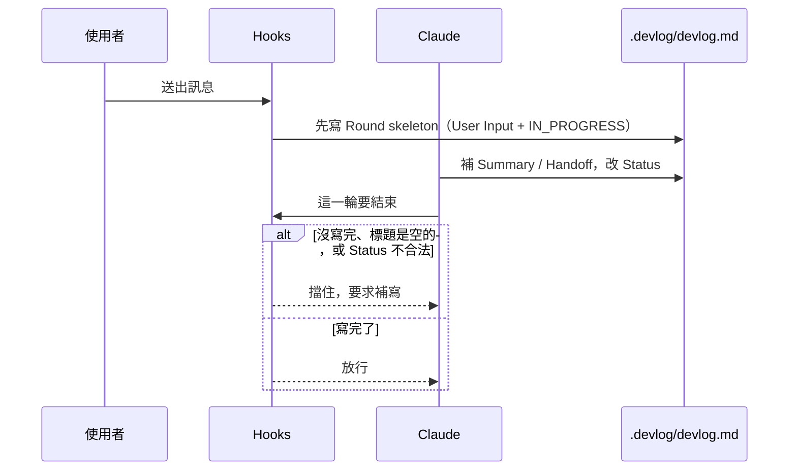

# devlog-tracker

版本 `0.6.0`。在專案中維護一份 `.devlog/devlog.md`，把每一輪對話的請求、決策與結果寫成永久紀錄。對話一 `/clear` 或換 session 就沒了；這份檔案取代那個缺口，
讓工作可以中斷再接。沒下過 `/devlog-tracker:start` 時，裝著也不會動任何檔案。

## 特色

### 指令

| 指令 | 做什麼 |
|---|---|
| `/devlog-tracker:start` | 跑腳本建立 `.devlog/.enabled`（缺的 state 檔會補上，已有門檻不重置）。讀檔對進度，不自動開工。`.devlog/` 含 prompt，會建議加進 `.gitignore`，要你同意才改。 |
| `/devlog-tracker:continue` | 讀 `.devlog/devlog.md`，依最後一輪 Handoff 的下一步接著做。`/clear` 之後要接續用這個。細節見 [`docs/design/continue.md`](docs/design/continue.md)。 |
| `/devlog-tracker:pause` | 暫停強制記錄，歷史檔不動，之後可再 `start`。 |
| `/devlog-tracker:compact` | 腳本把較舊的 `DONE` 輪次搬到 `devlog.archive.md`（Checkpoint 與未完成輪留在主檔）。 |
| `/devlog-tracker:keep` | 確認後由腳本把有主題的一段搬走成 `devlog.<name>.md`。不是 compact。細節見 [`docs/design/keep.md`](docs/design/keep.md)。 |
| `/devlog-tracker:resume <name>` | 讀具名保存檔的最後一輪與 Handoff，新工作仍寫回主 `devlog.md`。 |
| `/devlog-tracker:status` | 查看強制記錄開關、Span、Checkpoint、Segment Watch 與最後一輪 Status。 |
| `/devlog-tracker:span` | 開啟或關閉自動續接長任務使用的 Span Mode（不要手寫 `.span-open` JSON）。 |

### 強制記錄開著之後



每一輪固定四塊：`User Input`（貼近原話，常見 token 會遮罩）、`Summary`（給人掃）、`Handoff`（給下一輪 Claude：決策／檔案／現況／下一步）、`Status`（`DONE` / `IN_PROGRESS` / `BLOCKED` / `INTERRUPTED`）。Stop 會確認標題底下有內容、Status 是這四個值之一，以及進行中／卡住時有「下一步」。細節見 [`docs/design/summary-handoff.md`](docs/design/summary-handoff.md) 和 SKILL.md。

### hook 會自動做的事

- **自動接續**：`SessionStart` hook 在開新 session、resume、`/compact`、`/fork` 時，注入最後一個 Checkpoint（若有）加上最近兩輪的 Summary / Handoff / Status，不是整份檔。`/clear` 是真的清空，不注入；要接續請 `/devlog-tracker:continue`。細節見 [`docs/design/continue.md`](docs/design/continue.md)。
- **意外中斷**：非 usage 的 API 錯誤、SessionEnd、殘留的 `.round-open` 會把開著的 Round 標成 `INTERRUPTED`。usage 用光不算中斷。中途取消（例如 Esc）通常是在**下一則訊息**或**下次 SessionStart（startup / resume / clear / fork）**才補上；`PostToolUseFailure` 的 `is_interrupt` 若有觸發，只是 best-effort，不能當成一定會立刻蓋章。細節見 [`docs/design/recording-moments.md`](docs/design/recording-moments.md)。
- **段落記錄**：長輪不要憋到最後，邊做邊寫 `### 段落`。同一輪連續約 15 分鐘沒改 `devlog.md`，`PreToolUse` hook 會擋住下一個工具，要求先補一段（門檻可調）。子 agent 的工具呼叫不會沿用父輪這道閥。細節見 [`docs/design/segment-watch.md`](docs/design/segment-watch.md)。
- **Checkpoint Mode**：累積約 20 輪沒寫跨輪摘要，`Stop` hook 會要求補一段 `## Checkpoint`（門檻可調）。細節見 [`docs/design/checkpoint-mode.md`](docs/design/checkpoint-mode.md)。
- **Span Mode**：`/loop`、Workflow 這類自動續接的長任務，不必每個 tick 都寫完整 Round，用 tick 計數當安全閥；崩潰最多漏記固定數量的 tick，不是整段。細節見 [`docs/design/span-mode.md`](docs/design/span-mode.md)。

## 安裝

作為 Claude Code plugin 安裝（會自動更新）：

```
/plugin marketplace add gogogohuang/devlog-tracker
/plugin install devlog-tracker@devlog-tracker
```

### Cursor（選用）

Claude Code 仍是主要安裝方式。若要在 Cursor workspace 使用，先設定
`DEVLOG_TRACKER_ROOT` 為本 plugin 的絕對路徑，再把 `cursor/hooks.json` 的
`hooks` 合併進專案 `.cursor/hooks.json`。也可以把整個 `cursor/hooks/` 與
`hooks/scripts/` vendoring 到專案，並調整 command 路徑；兩者的相對目錄必須維持可用。

Cursor cloud agent 不執行 `sessionStart`，因此不會自動注入接手摘要；其他已設定的
hook 仍依 Cursor 支援的事件執行。

## 使用

在專案裡下一次：

```
/devlog-tracker:start
```

之後正常跟 Claude 對話即可，每一輪結束前都會被強制檢查、補上 `.devlog/devlog.md` 的紀錄。`/clear` 之後 context 是空的；要接著做上一題，下 `/devlog-tracker:continue`。暫停、歸檔、具名搬走、狀態與 span 見上方指令表（完整 namespace，plugin 名稱是 `devlog-tracker`）。

測試：`bash hooks/scripts/run-tests.sh`（含 Cursor adapter）。

## 目錄結構

```
devlog-tracker/
├── .gitignore
├── .github/workflows/hooks.yml          # 每次 push / PR 執行 hook 自我檢查
├── .claude-plugin/
│   ├── plugin.json        # plugin manifest
│   └── marketplace.json   # 讓這個 repo 本身就是一個 marketplace
├── cursor/
│   ├── hooks.json         # Cursor hooks 設定範本
│   └── hooks/             # Cursor 事件轉接至共用 bash scripts
├── docs/design/
│   ├── span-mode.md           # Span Mode 設計文件
│   ├── checkpoint-mode.md     # Checkpoint Mode 設計文件
│   ├── segment-watch.md       # 單輪沉默 15 分鐘保底
│   ├── summary-handoff.md     # 每輪 Summary（人）+ Handoff（AI）設計文件
│   ├── recording-moments.md   # 送出時 skeleton、正常收尾、意外 INTERRUPTED
│   ├── continue.md            # /clear 不注入，/continue 才讀檔接續
│   └── keep.md                # 具名搬走成 devlog.<name>.md
├── skills/devlog-tracker/SKILL.md
├── hooks/
│   ├── hooks.json                       # SessionStart / UserPromptSubmit / PreToolUse / Stop / StopFailure / SessionEnd / PostToolUseFailure
│   └── scripts/
│       ├── start-devlog.sh              # /start：建開關與缺的 state 檔
│       ├── pause-devlog.sh              # /pause：刪開關，不動歷史
│       ├── compact-devlog.sh            # /compact：確定性搬檔
│       ├── keep-move.sh                 # /keep：確定性搬走具名檔
│       ├── resume-devlog.sh             # /resume：驗證 keep 檔並印出內容
│       ├── status-devlog.sh             # /status：唯讀狀態
│       ├── span-open.sh / span-close.sh # /span：寫或刪 .span-open
│       ├── await-open.sh                # Reply Fold：寫 .awaiting-reply
│       ├── session-start-devlog.sh      # 接手摘要（clear 不注入）
│       ├── round-start.sh               # 送出時寫 Round skeleton（含 prompt 遮罩）
│       ├── close-open-round.sh          # 把開著的 Round 標成 INTERRUPTED
│       ├── on-stop-failure.sh           # StopFailure：非 usage 錯誤標中斷
│       ├── on-session-end.sh            # SessionEnd：殘留 round 標中斷
│       ├── on-tool-failure.sh           # PostToolUseFailure：工具失敗時標中斷
│       ├── json-field.sh                # hook state JSON 共用讀寫
│       ├── redact-prompt.sh             # User Input 常見 token 遮罩
│       ├── devlog-lock.sh               # .devlog/.lock，寫入序列化
│       ├── devlog-md.sh                 # fence-aware Round 切塊
│       ├── segment-watch.sh             # 同一輪太久沒寫就擋住下一個工具
│       ├── enforce-devlog.sh            # Stop：Summary/Handoff 內容、Status、Span、Checkpoint
│       ├── run-tests.sh                 # 執行 hooks/scripts/test-*.sh + cursor/hooks/test-adapters.sh
│       └── test-*.sh                    # 各腳本自我檢查
└── commands/
    ├── start.md / pause.md / continue.md
    ├── compact.md / keep.md / resume.md
    └── status.md / span.md
```

## License

Apache-2.0
