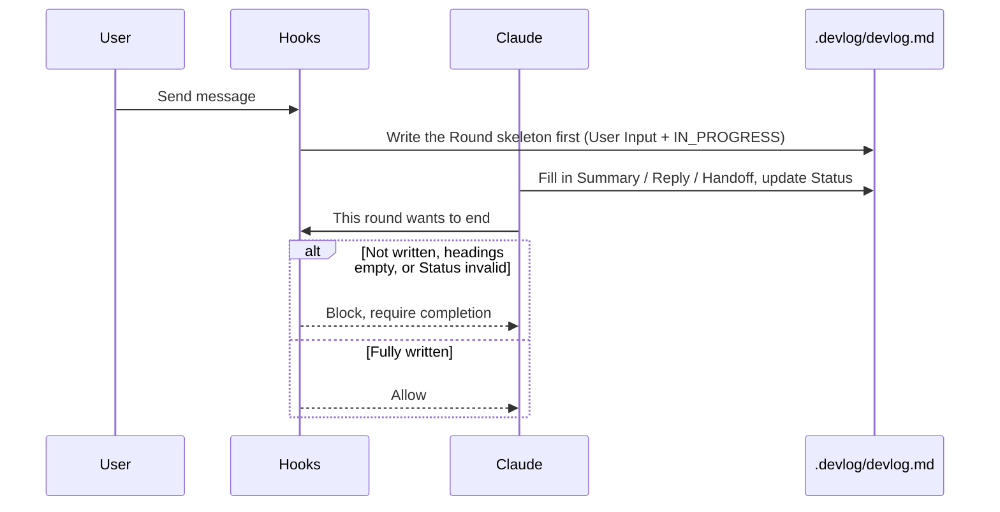

# devlog-tracker

*English | [繁體中文](README.zh-TW.md)*

**Version** 0.28.1

Maintains a `.devlog/devlog.md` in your project, turning each conversation round's requests, decisions, and outcomes into a permanent record. A conversation disappears the moment you `/clear` or switch sessions; this file fills that gap so work can pause and resume. Nothing is touched until you explicitly run `/devlog-tracker:start` — installing the plugin alone doesn't create or modify any files.

## What this is

Writes "what this round did, what was decided, what's next" into the project's `devlog.md`. A Stop hook guarantees every round is fully written before it's allowed to end; nothing under `.devlog/` is created or changed before an explicit `/devlog-tracker:start`.

`devlog.md` is only responsible for **cross-session handoff continuity** (the decision trail, current blockers, completion criteria, next steps), and serves as the main entry point for **L1** — after a human-triggered continue or a session-start injection, the agent picks up relying solely on this SSOT, and must **write back** this round's state into this file. It is not the single source of truth for the whole project:

- The source of truth for code/file state is still git
- The source of truth for the full verbatim process is the conversation transcript (gone after `/clear`)
- The source of truth for design decisions is `docs/design/*.md`

This file simply replaces the gap left by "the terminal clears and it's gone," so work can be interrupted and picked back up at any time. L2 (unattended wake-ups) and L3 (cross-machine shared `.devlog/`) are out of scope; see [`docs/design/devlog-as-ssot-assessment.md`](docs/design/devlog-as-ssot-assessment.md) for details.

Every round wraps up with a fixed `Summary`/`Reply` (what was told to the user)/`Handoff` (including `Completion criteria` when unfinished)/`Status`. Picking up work means: check the workspace → do the next step → **write back**; reading without writing counts as a failed handoff.

## Install

The three platforms are peers, each installed independently; a given project can use one or several, but the same platform should **not** use both the plugin marketplace and `npx init` at once — that fires the hook twice.

### Claude Code

**Option 1: plugin marketplace (auto-updates)**

```
/plugin marketplace add gogogohuang/devlog-tracker
/plugin install devlog-tracker@devlog-tracker
```

Commands are under `/devlog-tracker:*` (e.g. `/devlog-tracker:start`).

**Option 2: npx (vendored into the project, version pinnable)**

```bash
npx devlog-tracker init --claude
```

Merges the hooks into `.claude/settings.local.json` (not `settings.json` — the merged command paths contain this machine's absolute paths and shouldn't be committed; `settings.local.json` is gitignored by Claude Code by default), and converts `commands/*.md` into `.claude/skills/devlog-<name>/SKILL.md`, invoked with `/devlog-<name>`; it also adds a `<!-- devlog-tracker:begin/end -->` fallback block to `CLAUDE.md`.

### Codex

```bash
npx devlog-tracker init --codex
```

Merges the `hooks` from `codex/hooks.json` into the project's `.codex/hooks.json`, and generates `.agents/skills/devlog-<name>/SKILL.md` from `commands/*.md`, invoked with `$devlog-<name>` (or picked from `/skills`); it also adds the same kind of fallback block to `AGENTS.md`. Files the older 0.25.0 version wrote to `.codex/prompts/` are cleared out on the next `init` run — Codex doesn't read project-level custom prompts.

**Hooks require approval before they run.** Codex requires approval for new or changed hooks; an unapproved hook is silently skipped — **with no warning at all**, so it looks like devlog just isn't recording. This is independent of whether the project is set to `trust_level = "trusted"`; project trust doesn't make hooks active.

- Interactive mode: the first time you open it, Codex prompts that hooks need approval; they only run once approved. A later change to hook configuration (e.g. re-running `init` and changing paths or commands) may require approval again.
- Non-interactive `codex exec` (CI, scripts): unapproved hooks are silently skipped. `--dangerously-bypass-hook-trust` lets them run, but that flag skips trust checks for *all* hooks, so it's only appropriate for automation environments where you've already vetted the hook sources yourself.
- To confirm it's working: after `start`, send a message and check whether `.devlog/.round-current.md` shows this round's User Input skeleton; if not, the hook didn't run.

Codex currently has no equivalent to "user interrupted" (Claude Code's `PostToolUseFailure`/`is_interrupt`) or "this round ended abnormally" (`StopFailure`); these two detailed states won't be marked `INTERRUPTED` on Codex, but the core enforcement mechanism (the `Stop` event blocking unfinished rounds) is unaffected.

### Cursor

```bash
npx devlog-tracker init --cursor
```

Merges the `hooks` from `cursor/hooks.json` into the project's `.cursor/hooks.json`. Cursor has no slash-command surface, so once hooks are installed, follow the steps in `commands/*.md` to run the corresponding scripts manually. Cursor's cloud agent doesn't run `sessionStart`, so it won't auto-inject a handoff summary; other configured hooks still run on whichever events Cursor supports.

### All three platforms

```bash
npx devlog-tracker init
```

Without `--claude`/`--codex`/`--cursor`, it interactively asks which platform(s) to install; in an environment without a TTY (e.g. CI) and no flags given, `init` skips the prompt and installs all three platforms directly. You can also combine flags, e.g. `npx devlog-tracker init --claude --codex`.

Copies `core/scripts/`, `claude/hooks.json`, `codex/hooks/`, `cursor/hooks/`, `skills/`, and `commands/` into the project's `.devlog-tracker/`. Re-running `npx devlog-tracker init` upgrades to the package's current version; `npx devlog-tracker status` checks whether the installed version is behind.

`init` writes this machine's absolute paths into each platform's hooks config and into `.devlog-tracker/env.sh`. If you commit these files to git, each teammate needs to run `npx devlog-tracker init` on their own machine (paths differ per machine); alternatively, add `.devlog-tracker/` and the generated hooks config files to `.gitignore`.

To install manually (without npx), set `DEVLOG_TRACKER_ROOT` to this plugin's absolute path, and merge the `hooks` from the matching platform's `hooks.json` into the project config; `commands/*.md` prefers `DEVLOG_TRACKER_ROOT`, falling back to `CLAUDE_PLUGIN_ROOT`:

```bash
export DEVLOG_TRACKER_ROOT=/absolute/path/to/devlog-tracker
export DEVLOG_PROJECT_DIR="$(pwd)"
bash "$DEVLOG_TRACKER_ROOT/core/scripts/start-devlog.sh"
bash "$DEVLOG_TRACKER_ROOT/core/scripts/status-devlog.sh"
bash "$DEVLOG_TRACKER_ROOT/core/scripts/segment-watch-set.sh" 600
bash "$DEVLOG_TRACKER_ROOT/core/scripts/checkpoint-set.sh" 20
# pause / span-open / span-close / compact / keep-move / clean / resume: see commands/*.md
```

## Quick start

Run once in your project (pick whichever matches your install method):

```
/devlog-tracker:start   # Claude Code plugin
/devlog-start           # npx init --claude
$devlog-start           # npx init --codex
```

After that, just converse normally — every round is enforced-checked and `.devlog/devlog.md` gets updated before it can end. After `/clear`, context is empty; to pick up prior work, run the matching `continue` command. See the command table below for pause, archive, named export, status, and span.

## Commands

The table below uses the plugin's `/devlog-tracker:*` namespace; `npx init --claude` installs `/devlog-<name>`, and `npx init --codex` installs `$devlog-<name>` — the command content is the same.

| Command | What it does |
|---|---|
| `/devlog-tracker:start` | Runs a script that creates `.devlog/.enabled` (missing state files are backfilled; existing thresholds aren't reset). Reads the file to check progress; doesn't auto-start work. `.devlog/` contains a prompt suggesting adding it to `.gitignore`, and only edits it with your consent. |
| `/devlog-tracker:continue` | Reads `.devlog/devlog.md`, checks the last round's Handoff "Workspace" section, then continues per its next step. Use this after `/clear` to resume. See [`docs/design/continue.md`](docs/design/continue.md). |
| `/devlog-tracker:pause` | Pauses enforced recording; history files are untouched, and you can `start` again later. |
| `/devlog-tracker:compact` | A script moves older `DONE` rounds into `devlog.archive.md` (Checkpoints and unfinished rounds stay in the main file). |
| `/devlog-tracker:keep` | Scans the whole file, groups it by topic, lists suggestions at once, then — after confirmation — moves each section out into its own `devlog.<name>.md` (leaving a `## Kept index` pointer line with a one-sentence topic description in the main file); can also extract a single section or merge everything into one history file. Not the same as compact. See [`docs/design/keep.md`](docs/design/keep.md). |
| `/devlog-tracker:overview` | Reads all kept `devlog.<name>.md` files and merges them into a cross-topic overview, plus a list of candidate rules that look like they belong in `CLAUDE.md`. Read-only — no workspace check, no confirmation, no writes. See the Kept index section of [`docs/design/keep.md`](docs/design/keep.md). |
| `/devlog-tracker:search <keyword>` | Case-insensitive string search across `devlog.md`/`devlog.archive.md`/kept `devlog.<name>.md`/`devlog.lessons.<topic>.md`; Claude answers in its own words from the hits (with file/heading/line as evidence). Read-only — no workspace check, no confirmation, no writes. |
| `/devlog-tracker:resume <name>` | Reads the last round and Handoff of a named saved file, checks the "Workspace" section, and proposes how to continue; new work is still written back to the main `devlog.md`. |
| `/devlog-tracker:clean` | Unconditionally clears `devlog.md` (including the project summary and all Round history) — no move, no backup, not reversible; it always asks first, and only proceeds once you explicitly reply "clear". Keeps only the currently open round, renumbered as `## Round 1`. |
| `/devlog-tracker:status` | Shows whether enforced recording is on, Span, Checkpoint, Segment Watch, the Lessons Mode workspace-drift count, and the last round's Status. |
| `/devlog-tracker:span` | Turns Span Mode on/off, used for auto-continuing long-running tasks (don't hand-edit the `.span-open` JSON). |
| `/devlog-tracker:segment-watch <duration>` | Adjusts Segment Watch's silence threshold (default 10 minutes). Reports `NOT_STARTED` and creates no files if the project hasn't run `/devlog-tracker:start`. |
| `/devlog-tracker:checkpoint <rounds>` | Adjusts Checkpoint Mode's silence threshold (default 20 rounds). Reports `NOT_STARTED` if the project hasn't started. |
| `/devlog-tracker:lessons-on` | Turns on Lessons Mode, which is off by default (subordinate to the main switch; refuses if `start` hasn't run). See [`docs/design/lessons-mode.md`](docs/design/lessons-mode.md). |
| `/devlog-tracker:lessons-off` | Turns off Lessons Mode; doesn't touch any already-written `devlog.lessons.*.md` files or the index. |
| `/devlog-tracker:lessons [<topic>]` | No topic given: prints the `## Lessons index`. Topic given: prints that topic file's full content. Read-only — no workspace check, no confirmation. |
| `/devlog-tracker:lessons-drift <count>` | Adjusts the threshold for Lessons Mode's "recurring workspace drift" mechanical reminder (default 3). Subordinate to Lessons Mode; reports `LESSONS_NOT_ENABLED` if it's off. |

## Once enforced recording is on



Every round has these fixed sections:

- **`User Input`** — the raw submitted text takes priority (written by the hook; Claude shouldn't rewrite it), common tokens are masked
- **`Summary`** — a conclusion a human can scan
- **`Reply`** — what was said/promised to the user this round
- **`Handoff`** — for the next round to pick up (decisions / files / workspace / current state / completion criteria / next steps)
- **`Status`** — one of `DONE` / `IN_PROGRESS` / `BLOCKED` / `INTERRUPTED`

"Workspace" is a git snapshot taken at wrap-up time; required whenever in progress or blocked. `DONE` also requires it if "Files" has content (claiming files were touched/committed). "Completion criteria" is required whenever in progress or blocked.

The Stop hook does the following:

1. Confirms `Summary`/`Reply`/`Handoff` headings have content underneath, and Status is one of the four values above; Handoff subsections must be in the order Decisions → Files → Workspace → Current state → Completion criteria → Next steps
2. In-progress/blocked rounds must have "Completion criteria" and "Next steps"; "Next steps" can't be pure blacklisted filler (e.g. a section that just says "continue finishing up" — string matching, not semantic scoring; see [`docs/design/next-step-blacklist.md`](docs/design/next-step-blacklist.md)); in-progress rounds get an additional lightweight actionability check; blocked rounds require "Current state" or "Next steps" to contain a missing-piece phrasing
3. Machine-verifies that "Workspace" matches the actual git state at wrap-up time, verbatim (always checked when in progress/blocked; only checked for `DONE` when "Files" is non-empty) — this catches claims like "already committed" that don't actually match reality

When `#### Files` is non-empty, it's likewise machine-verified: the commit section must match that commit's actual content verbatim; for uncommitted sections, it only requires that the claimed paths actually have changes (not full coverage, so leftovers from a previous round aren't counted as missing from this one).

See [`docs/design/summary-handoff.md`](docs/design/summary-handoff.md), [`docs/design/devlog-as-ssot-assessment.md`](docs/design/devlog-as-ssot-assessment.md), [`docs/design/files-verify.md`](docs/design/files-verify.md), and SKILL.md for details.

## What the hooks do automatically

The normal rule is "one user message = one round, and Summary/Reply/Handoff/Status must be fully written before it ends." The four mechanisms below each relax a different slice of that rule; they're orthogonal and can coexist:

| Mechanism | What it relaxes | What problem it solves |
|---|---|---|
| **Span Mode** | Whether each automatic wake-up counts as a round | Long-running tasks driven by their own schedule (`/loop`, Workflow) rather than a user typing — forcing a full Round on every automatic tick produces a flood of meaningless records, or even stalls the whole automation |
| **Checkpoint Mode** | Whether there's a cross-round summary waypoint | Normal interactive conversation writes every round fine, but once the round count grows, reviewers have to crawl through every round to see overall progress; each checkpoint uses a fixed **Decisions / Open questions / Failed attempts** layout so SessionStart injection surfaces blockers quickly |
| **Reply Fold** | Whether a question-and-answer counts as two rounds | When Claude ends with a plain-text question and the next message is really the answer, the default logic (every `UserPromptSubmit` opens a new Round) would hard-split that Q&A into two unrelated rounds |
| **Segment Watch** | Whether a round leaves intermediate traces internally | A round that takes a long time (explore, then decide, then implement, then verify) and only writes once at the very end loses the whole process if it crashes partway |

Here's how each mechanism actually behaves when triggered:

#### Auto-continue

The `SessionStart` hook, on new session / resume / `/compact` / `/fork`, first injects the branch-scoped `.devlog/handoff.md` snapshot when non-empty, then the last Checkpoint (if any — including its `### 待解問題` section for open blockers), the `## Kept index` (if any — not the named files' content), plus the last two rounds' Summary / Handoff / Status — not the whole file. Stop overwrites the handoff file on `IN_PROGRESS`／`BLOCKED` closes and deletes it on `DONE`. `/clear` truly clears everything and injects nothing; to continue, use `/devlog-tracker:continue` (which checks "Workspace" first, then proceeds). See [`docs/design/continue.md`](docs/design/continue.md) and [`docs/design/session-handoff-file.md`](docs/design/session-handoff-file.md).

#### Same-round workspace-drift detection

When the next message in the same conversation is sent, `UserPromptSubmit` compares the previous round's Handoff "Workspace" against the current git state; on a mismatch, it injects a notice and has `PreToolUse` block non-devlog tools until this round adds a `### Segment` containing an actual snapshot (read-only `git status`/`diff`/`log`/`show`/`rev-parse` are unaffected, so you can check for yourself). Quiet Span ticks, task-notifications, and `DONE` aren't blocked. See [`docs/design/continue.md`](docs/design/continue.md) and [`docs/design/segment-watch.md`](docs/design/segment-watch.md).

#### Unexpected interruption

Non-usage API errors, SessionEnd, and a leftover `.round-open` mark an open Round as `INTERRUPTED`. Running out of usage doesn't count as an interruption. A mid-task cancel (e.g. Esc) is usually only recorded on the **next message** or the **next SessionStart** (startup / resume / clear / fork); `PostToolUseFailure`'s `is_interrupt`, when it fires, is best-effort only and can't be relied on to stamp this immediately. A `[reason: ...]` internal code is appended below `Status` for later debugging (e.g. `dangling:next_prompt`); if the interruption happened while waiting on an `AskUserQuestion` answer, Summary/Handoff will say so directly rather than being recorded as an "unexpected" interruption. See [`docs/design/recording-moments.md`](docs/design/recording-moments.md).

#### Segment recording

Don't hold a long round until the very end — write `### Segment` entries as you go. If `.round-current.md` hasn't been touched for about 10 minutes within the same round, the `PreToolUse` hook blocks the next tool call; Read first, then Edit/StrReplace to append a segment (don't Write over the whole file). The threshold is adjustable with `/devlog-tracker:segment-watch <duration>`. Claude Code subagents/dynamic workflows (`PreToolUse` carrying `agent_id`) don't apply this gate from the parent round. See [`docs/design/segment-watch.md`](docs/design/segment-watch.md).

#### Checkpoint Mode

After roughly 20 rounds without a cross-round summary, the `Stop` hook requires a new `## Checkpoint（Round X-Y）` block (threshold adjustable). Content is structured, not free prose — three subsections under the heading:

- **`### 決策`** — decisions made in that stretch
- **`### 待解問題`** — still-open blockers (primary handoff cue for the next session)
- **`### 失敗嘗試`** — approaches tried and abandoned, so the next agent doesn't repeat them

Hook detection is unchanged (only the `## Checkpoint` heading is verified, not subsection quality). Authoring rules: [`skills/devlog-tracker/references/checkpoint-mode.md`](skills/devlog-tracker/references/checkpoint-mode.md); design: [`docs/design/checkpoint-mode.md`](docs/design/checkpoint-mode.md).

#### Span Mode

Long-running auto-continuing tasks (`/loop`, Workflow) don't need a full Round on every tick; a tick counter acts as the safety valve, so a crash loses at most a fixed number of ticks, not the whole span. See [`docs/design/span-mode.md`](docs/design/span-mode.md).

#### Reply Fold

When Claude ends a turn with a plain-text question and the next message is the answer, there's no need to open a new Round — record the question text manually first, run `await-open.sh` to mark it, and the next message (the answer) automatically folds into the same Round as a `### Segment`, instead of splitting into two unrelated Rounds. During a long back-and-forth (e.g. grilling), only the question is logged per turn mid-way; Summary/Reply/Handoff/Status don't need to be rewritten every turn — wrap up once when the whole Q&A actually ends. `AskUserQuestion` asks and answers within the same turn, so it doesn't need folding, but still records the question and answer in a `### Segment (AskUserQuestion)`. Background task-notifications (subagent completion notices) also go through this same folding mechanism automatically, keeping only a condensed summary rather than the raw XML. See [`docs/design/reply-fold.md`](docs/design/reply-fold.md).

#### Per-branch devlog files

Switching branches within the same working directory automatically splits the main file by the checked-out branch: `main`/`master` keeps using `.devlog/devlog.md`, while other branches each use `.devlog/devlog.<branch>.md` (slashes converted to `-`). A separate `git worktree` (a different directory) already has its own independent `.devlog/` and is unaffected by this mechanism. The first time a branch is detected without its own file while `devlog.md` already has content, it gets renamed (not copied) into that branch's file. See [`docs/design/branch-scoped-devlog.md`](docs/design/branch-scoped-devlog.md).

#### Lessons Mode (off by default, not automatic)

When enabled, a development-lesson entry is only considered when a `BLOCKED` status resolves, an obvious detour happens, or workspace drift accumulates to a threshold (default 3, adjustable via `/devlog-tracker:lessons-drift <count>`); it's stored per-topic as `devlog.lessons.<topic>.md`, with `devlog.md` keeping only a heading index. None of the three signals are enforced by a hook themselves, and this isn't a knowledge base (architectural decisions still live in `docs/design/*.md`). See [`docs/design/lessons-mode.md`](docs/design/lessons-mode.md).

## Tests

```
bash core/scripts/run-tests.sh
```

Includes the Cursor adapter.

## License

Apache-2.0
