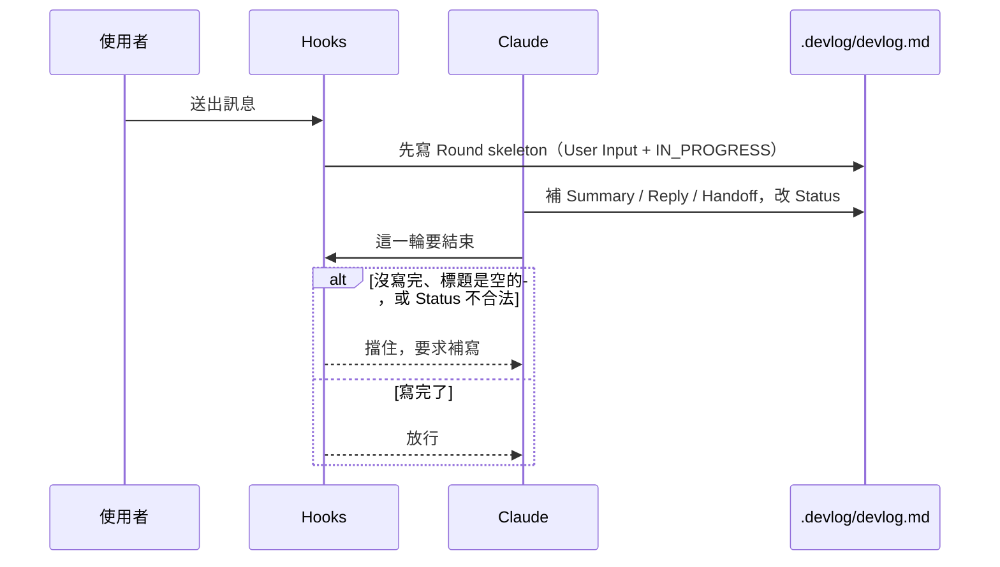

# devlog-tracker

*[English](README.md) | 繁體中文*

**版本** 0.28.0

在專案中維護一份 `.devlog/devlog.md`，把每一輪對話的請求、決策與結果寫成永久紀錄。對話一 `/clear` 或換 session 就沒了；這份檔案取代那個缺口，讓工作可以中斷再接。沒下過 `/devlog-tracker:start` 時，裝著也不會動任何檔案。

## 這是什麼

把「這輪做了什麼、決定了什麼、下一步是什麼」寫進專案內的 `devlog.md`。Stop hook 保證每輪都寫完才放行；沒明確 `/devlog-tracker:start` 前不會建立或改動 `.devlog/`。

`devlog.md` 只管**跨 session 的交接連續性**（決策軌跡、目前卡點、完成條件、下一步），並作為 **L1**（人觸發 continue／開 session 注入後，agent 只靠 SSOT 接手，且必須把本輪狀態**寫回**本檔）的主入口。不是整個專案的單一真相來源：

- 程式碼／檔案狀態的真相仍是 git
- 完整逐字過程的真相是對話 transcript（`/clear` 後不存在）
- 設計決策的真相是 `docs/design/*.md`

這份檔案只是取代「終端機一 clear 就沒了」的缺口，讓工作可以隨時中斷、隨時接續。L2（無人喚醒）與 L3（跨機共享 `.devlog/`）不在範圍；細節見 [`docs/design/devlog-as-ssot-assessment.md`](docs/design/devlog-as-ssot-assessment.md)。

每輪收尾固定寫 `Summary`／`Reply`（對使用者說過的話）／`Handoff`（含未完成時的 `完成條件`）／`Status`。接手＝核對工作區 → 做下一步 → **寫回**；讀而不寫算交接失敗。

## 安裝

三個平台對等，各自獨立安裝；同一個專案要用哪個或哪幾個都可以，但同一個平台**不要同時**用 plugin marketplace 跟 `npx init` 兩條路線，會讓 hook 觸發兩次。

### Claude Code

**方式一：plugin marketplace（會自動更新）**

```
/plugin marketplace add gogogohuang/devlog-tracker
/plugin install devlog-tracker@devlog-tracker
```

指令用 `/devlog-tracker:*`（例如 `/devlog-tracker:start`）。

**方式二：npx（vendor 進專案，版本可鎖定）**

```bash
npx devlog-tracker init --claude
```

會把 hooks 合併進 `.claude/settings.local.json`（不是 `settings.json`——合併後的指令路徑含這台機器的絕對路徑，不該 commit；`settings.local.json` 是 Claude Code 預設 gitignore 的檔案），並把 `commands/*.md` 轉成 `.claude/skills/devlog-<名稱>/SKILL.md`，用 `/devlog-<名稱>` 執行；同時在 `CLAUDE.md` 加上一段 `<!-- devlog-tracker:begin/end -->` fallback 說明。

### Codex

```bash
npx devlog-tracker init --codex
```

會把 `codex/hooks.json` 的 `hooks` 合併進專案 `.codex/hooks.json`，並從 `commands/*.md` 產生 `.agents/skills/devlog-<名稱>/SKILL.md`，用 `$devlog-<名稱>`（或 `/skills` 選）執行；同時在 `AGENTS.md` 加上同一種 fallback 說明區塊。舊版（0.25.0）寫到 `.codex/prompts/` 的檔案會在重跑 `init` 時清掉——Codex 不讀專案層級的 custom prompts。

**hook 需要審核才會執行。** Codex 對新增或有變動的 hook 要求先審核；沒核准的 hook 會被直接略過，而且**沒有任何警告**，看起來就像 devlog 沒在記錄。這跟專案有沒有設成 `trust_level = "trusted"` 是兩回事，專案信任不會讓 hook 生效。

- 互動模式：第一次開啟時 Codex 會提示有 hook 需要審核，核准後才會執行。之後 hook 的設定有變動（例如重跑 `init` 讓路徑或指令改變）也可能要再核准一次。
- 非互動的 `codex exec`（CI、腳本）：未審核的 hook 會被靜默略過。`--dangerously-bypass-hook-trust` 可以讓它們跑起來，但那個旗標會略過所有 hook 的信任檢查，只適合已經自己確認過 hook 來源的自動化環境。
- 想確認有沒有生效：`start` 之後送一則訊息，看 `.devlog/.round-current.md` 有沒有出現這一輪的 User Input skeleton；沒有就代表 hook 沒被執行。

Codex 目前沒有對應「使用者中斷」（Claude Code 的 `PostToolUseFailure`／`is_interrupt`）與「這輪異常結束」（`StopFailure`）的事件，這兩種細節狀態在 Codex 上不會被標記成 `INTERRUPTED`；核心強制記錄機制（`Stop` 事件擋住未寫完的輪次）不受影響。

### Cursor

```bash
npx devlog-tracker init --cursor
```

會把 `cursor/hooks.json` 的 `hooks` 合併進專案 `.cursor/hooks.json`。Cursor 沒有 slash 指令面，hooks 裝好後照 commands/*.md 的步驟手動執行對應腳本。Cursor cloud agent 不執行 `sessionStart`，因此不會自動注入接手摘要；其他已設定的 hook 仍依 Cursor 支援的事件執行。

### 三平台共通

```bash
npx devlog-tracker init
```

沒帶 `--claude`／`--codex`／`--cursor` 時會互動式問要裝哪個平台；在沒有 TTY 的環境（例如 CI）且沒帶旗標時，`init` 不會詢問，直接安裝全部三個平台。也可以組合指定，例如 `npx devlog-tracker init --claude --codex`。

會把 `core/scripts/`、`claude/hooks.json`、`codex/hooks/`、`cursor/hooks/`、`skills/`、`commands/` 複製進專案的 `.devlog-tracker/`。重新執行 `npx devlog-tracker init` 可以升級到套件目前的版本；`npx devlog-tracker status` 可以查目前裝的版本是否落後。

`init` 會把這台機器專屬的絕對路徑寫進各平台的 hooks 設定檔與 `.devlog-tracker/env.sh`。如果你把這些檔案 commit 進 git，每位隊友都要在自己的機器上跑一次 `npx devlog-tracker init`（路徑每台機器不同）；或者改成把 `.devlog-tracker/` 與產生出來的 hooks 設定檔加進 `.gitignore`。

若要手動裝（不透過 npx），設定 `DEVLOG_TRACKER_ROOT` 為本 plugin 的絕對路徑，把對應平台的 `hooks.json` 的 `hooks` 合併進專案設定；`commands/*.md` 會優先讀 `DEVLOG_TRACKER_ROOT`，否則讀 `CLAUDE_PLUGIN_ROOT`：

```bash
export DEVLOG_TRACKER_ROOT=/absolute/path/to/devlog-tracker
export DEVLOG_PROJECT_DIR="$(pwd)"
bash "$DEVLOG_TRACKER_ROOT/core/scripts/start-devlog.sh"
bash "$DEVLOG_TRACKER_ROOT/core/scripts/status-devlog.sh"
bash "$DEVLOG_TRACKER_ROOT/core/scripts/segment-watch-set.sh" 600
bash "$DEVLOG_TRACKER_ROOT/core/scripts/checkpoint-set.sh" 20
# pause / span-open / span-close / compact / keep-move / clean / resume：見 commands/*.md
```

## 快速開始

在專案裡下一次（依安裝方式擇一）：

```
/devlog-tracker:start   # Claude Code plugin
/devlog-start           # npx init --claude
$devlog-start           # npx init --codex
```

之後正常對話即可，每一輪結束前都會被強制檢查、補上 `.devlog/devlog.md` 的紀錄。`/clear` 之後 context 是空的；要接著做上一題，下對應的 `continue` 指令。暫停、歸檔、具名搬走、狀態與 span 見下方指令表。

## 指令

下表以 plugin 的 `/devlog-tracker:*` namespace 表示；`npx init --claude` 裝的是 `/devlog-<名稱>`，`npx init --codex` 裝的是 `$devlog-<名稱>`，指令內容相同。

| 指令 | 做什麼 |
|---|---|
| `/devlog-tracker:start` | 跑腳本建立 `.devlog/.enabled`（缺的 state 檔會補上，已有門檻不重置）。讀檔對進度，不自動開工。`.devlog/` 含 prompt，會建議加進 `.gitignore`，要你同意才改。 |
| `/devlog-tracker:continue` | 讀 `.devlog/devlog.md`，核對最後一輪 Handoff「工作區」後再依下一步接著做。`/clear` 之後要接續用這個。細節見 [`docs/design/continue.md`](docs/design/continue.md)。 |
| `/devlog-tracker:pause` | 暫停強制記錄，歷史檔不動，之後可再 `start`。 |
| `/devlog-tracker:compact` | 腳本把較舊的 `DONE` 輪次搬到 `devlog.archive.md`（Checkpoint 與未完成輪留在主檔）。 |
| `/devlog-tracker:keep` | 掃全檔分主題，一次列出建議，確認後把各段各自搬走成 `devlog.<name>.md`（並在主檔留一個 `## Kept 索引` 指標行，含一句主題描述）；也可抽出一段或合併成全部歷史一檔。不是 compact。細節見 [`docs/design/keep.md`](docs/design/keep.md)。 |
| `/devlog-tracker:overview` | 讀完所有已 keep 的 `devlog.<name>.md`，整合成跨主題總覽，並列出看起來該進 `CLAUDE.md` 的規範候選。純讀取，不核對工作區、不等確認、不寫檔。細節見 [`docs/design/keep.md`](docs/design/keep.md) Kept index。 |
| `/devlog-tracker:search <關鍵字>` | 在 `devlog.md`／`devlog.archive.md`／已 keep 的 `devlog.<name>.md`／`devlog.lessons.<topic>.md` 裡做不分大小寫的字串搜尋；Claude 讀完命中後用自己的話回答（必要時附檔名／標題／行號）。純讀取，不核對工作區、不等確認、不寫檔。 |
| `/devlog-tracker:resume <name>` | 讀具名保存檔的最後一輪與 Handoff，核對「工作區」後提出接續；新工作仍寫回主 `devlog.md`。 |
| `/devlog-tracker:clean` | 無條件清空 `devlog.md`（含專案摘要與所有 Round 歷史），不搬移、不備份、不可復原；執行前一定會先問，要明確回覆「清空」才動手。只留目前開著的那一輪，重編成 `## Round 1`。 |
| `/devlog-tracker:status` | 查看強制記錄開關、Span、Checkpoint、Segment Watch、Lessons Mode 工作區漂移計數與最後一輪 Status。 |
| `/devlog-tracker:span` | 開啟或關閉自動續接長任務使用的 Span Mode（不要手寫 `.span-open` JSON）。 |
| `/devlog-tracker:segment-watch <時間長度>` | 調整 Segment Watch 的沉默門檻（預設 10 分鐘）。專案還沒 `/devlog-tracker:start` 時回報 `NOT_STARTED`，不會建立任何檔案。 |
| `/devlog-tracker:checkpoint <輪數>` | 調整 Checkpoint Mode 的沉默門檻（預設 20 輪）。專案還沒 start 時回報 `NOT_STARTED`。 |
| `/devlog-tracker:lessons-on` | 開啟預設關閉的 Lessons Mode（隸屬主開關，沒 `start` 過會拒絕）。細節見 [`docs/design/lessons-mode.md`](docs/design/lessons-mode.md)。 |
| `/devlog-tracker:lessons-off` | 關閉 Lessons Mode，不動任何已寫的 `devlog.lessons.*.md` 或索引。 |
| `/devlog-tracker:lessons [<topic>]` | 沒給 topic：印 `## Lessons 索引`。給 topic：印該主題檔全文。純讀取，不核對工作區、不等確認。 |
| `/devlog-tracker:lessons-drift <次數>` | 調整 Lessons Mode「工作區漂移重複發生」機制性提醒的門檻（預設 3 次）。隸屬 Lessons Mode，沒開會回報 `LESSONS_NOT_ENABLED`。 |

## 強制記錄開著之後



每一輪固定：

- **`User Input`** — 送出原文優先（hook 寫入；Claude 不要改寫），常見 token 會遮罩
- **`Summary`** — 給人掃的結論
- **`Reply`** — 這輪對使用者說過／答應過的話
- **`Handoff`** — 給下一輪接手（決策／檔案／工作區／現況／完成條件／下一步）
- **`Status`** — `DONE` / `IN_PROGRESS` / `BLOCKED` / `INTERRUPTED` 四選一

其中「工作區」是收尾時的 git 快照，進行中／卡住必寫；`DONE` 若「檔案」有內容（宣稱動過／commit 過檔案）也必寫。「完成條件」在進行中／卡住必寫。

Stop hook 會做這些事：

1. 確認 `Summary`／`Reply`／`Handoff` 標題底下有內容、Status 是上述四值之一；Handoff 小節順序為 決策 → 檔案 → 工作區 → 現況 → 完成條件 → 下一步
2. 進行中／卡住時有「完成條件」與「下一步」；「下一步」不是純黑名單空話（例如整節只寫「繼續完成」；字串比對，非語意評分，細節見 [`docs/design/next-step-blacklist.md`](docs/design/next-step-blacklist.md)）；進行中另做輕量可執行檢查；卡住時「現況」或「下一步」須含缺件句式
3. 機器核對「工作區」是否跟收尾當下的 git 狀態逐字相符（進行中／卡住一律核對，`DONE` 只在「檔案」非空時核對），避免「已 commit 完成」卻其實沒 commit 這類宣稱跟實際不符

`#### 檔案` 非空時同樣機器核對：commit 區塊要跟該次 commit 的實際內容逐字相符，未 commit 的區塊只要求宣稱的路徑真的存在變更（不要求涵蓋全部，避免把跨輪殘留算成這輪漏列）。

細節見 [`docs/design/summary-handoff.md`](docs/design/summary-handoff.md)、[`docs/design/devlog-as-ssot-assessment.md`](docs/design/devlog-as-ssot-assessment.md)、[`docs/design/files-verify.md`](docs/design/files-verify.md) 和 SKILL.md。

## Hook 會自動做的事

正常規則是「一則使用者訊息 = 一輪，結束前一定要寫完 Summary／Reply／Handoff／Status」。下面四個機制各自放寬這條規則的不同一塊，彼此正交、可以同時存在：

| 機制 | 放寬的是 | 解決的問題 |
|---|---|---|
| **Span Mode** | 「每次自動喚醒算不算一輪」 | `/loop`、Workflow 這類被自己排程反覆喚醒、不是使用者手動打字觸發的長任務，每個自動 tick 都強制寫完整 Round，會逼出大量沒意義的紀錄，甚至卡住整條自動化流程 |
| **Checkpoint Mode** | 「有沒有跨輪的摘要路標」 | 一般互動對話每輪都正常寫，但輪數一多，翻閱的人要逐輪爬完才知道整體進度；每段 checkpoint 固定 **決策／待解問題／失敗嘗試** 三段，SessionStart 注入時較容易抓到卡點 |
| **Reply Fold** | 「一問一答算不算兩輪」 | Claude 用純文字提問、下一則訊息其實是在回答時，預設邏輯（每個 `UserPromptSubmit` 開新 Round）會把這組問答硬拆成兩個不相關的 Round |
| **Segment Watch** | 「一輪內部要不要留階段性痕跡」 | 一輪做很久（先探索、再決策、再實作、再驗證），憋到最後才寫一次，中途 crash 會把整個過程全部遺失 |

以下是各機制實際觸發時的行為：

#### 自動接續

`SessionStart` hook 在開新 session、resume、`/compact`、`/fork` 時，若目前分支的 `.devlog/handoff.md`（或 `handoff.<branch>.md`）非空會先注入這份 Session Handoff 快照，再注入最後一個 Checkpoint（若有，含其中的 `### 待解問題` 供接手抓卡點）、`## Kept 索引`（若有，不是具名檔內容）加上最近兩輪的 Summary / Handoff / Status，不是整份檔。`IN_PROGRESS`／`BLOCKED` 收尾時 Stop 會覆寫 handoff 檔，`DONE` 會刪掉它。`/clear` 是真的清空，不注入；要接續請 `/devlog-tracker:continue`（先核對「工作區」再做下一步）。細節見 [`docs/design/continue.md`](docs/design/continue.md)、[`docs/design/session-handoff-file.md`](docs/design/session-handoff-file.md)。

#### 同輪工作區漂移偵測

同一條對話送出下一則訊息時，`UserPromptSubmit` 會拿上一輪 Handoff 的「工作區」跟目前 git 狀態比對；不符就注入提示，並讓 `PreToolUse` 擋住非 devlog 工具，直到這一輪補上含實際快照的 `### 段落`（唯讀的 `git status`／`diff`／`log`／`show`／`rev-parse` 不受影響，方便自行核對）。Span 安靜 tick、task-notification 與 `DONE` 不擋。細節見 [`docs/design/continue.md`](docs/design/continue.md) 與 [`docs/design/segment-watch.md`](docs/design/segment-watch.md)。

#### 意外中斷

非 usage 的 API 錯誤、SessionEnd、殘留的 `.round-open` 會把開著的 Round 標成 `INTERRUPTED`。usage 用光不算中斷。中途取消（例如 Esc）通常是在**下一則訊息**或**下次 SessionStart（startup / resume / clear / fork）**才補上；`PostToolUseFailure` 的 `is_interrupt` 若有觸發，只是 best-effort，不能當成一定會立刻蓋章。`Status` 下面會多一行 `[reason: ...]` 內部代號方便之後 debug（例如 `dangling:next_prompt`）；中斷當下如果是卡在等 `AskUserQuestion` 的回答，Summary/Handoff 會直接說明，不會寫成「意外」。細節見 [`docs/design/recording-moments.md`](docs/design/recording-moments.md)。

#### 段落記錄

長輪不要憋到最後，邊做邊寫 `### 段落`。同一輪連續約 10 分鐘沒改 `.round-current.md`，`PreToolUse` hook 會擋住下一個工具；先 Read 再 Edit／StrReplace 追加一段（不要 Write 覆寫整檔）。門檻可用 `/devlog-tracker:segment-watch <時間長度>` 調整。Claude Code subagent／dynamic workflow（PreToolUse 帶 `agent_id`）不套用父輪這道閥。細節見 [`docs/design/segment-watch.md`](docs/design/segment-watch.md)。

#### Checkpoint Mode

累積約 20 輪沒寫跨輪摘要，`Stop` hook 會要求補一段 `## Checkpoint（Round X-Y）`（門檻可調）。內容不用自由段落，標題下固定三小節：

- **`### 決策`** — 這段期間的定案
- **`### 待解問題`** — 仍懸而未決的卡點（下一 session 接手的首要線索）
- **`### 失敗嘗試`** — 試過但放棄的做法，避免下一任重踩

hook 偵測邏輯不變（仍只驗 `## Checkpoint` 標題有沒有新增，不驗三段內容）。撰寫規則見 [`skills/devlog-tracker/references/checkpoint-mode.md`](skills/devlog-tracker/references/checkpoint-mode.md)；設計見 [`docs/design/checkpoint-mode.md`](docs/design/checkpoint-mode.md)。

#### Span Mode

`/loop`、Workflow 這類自動續接的長任務，不必每個 tick 都寫完整 Round，用 tick 計數當安全閥；崩潰最多漏記固定數量的 tick，不是整段。細節見 [`docs/design/span-mode.md`](docs/design/span-mode.md)。

#### Reply Fold

Claude 用純文字結尾提出問題、下一則訊息才拿到答案時，不用開新 Round——提問前先手動記一段問題原文再跑 `await-open.sh` 標記，下一則訊息（答案）就會自動折進同一個 Round 當一段 `### 段落`，不是拆成兩個不相關的 Round。連續多輪一問一答（例如 grilling）時，中途每題只記問題段落，不必每題重寫 Summary/Reply/Handoff/Status，等整場問答真正結束才收尾一次。`AskUserQuestion` 在同一 turn 內問答，不用 fold，但仍要用 `### 段落（AskUserQuestion）` 記下問題與答案。背景 task-notification（子 agent 完成通知）也會自動走同一套折疊機制，不留原始 XML，只記精簡摘要。細節見 [`docs/design/reply-fold.md`](docs/design/reply-fold.md)。

#### 分支各自的 devlog 檔

同一個工作目錄裡切換分支時，主檔會依目前 checkout 的分支自動分開：`main`／`master` 繼續用 `.devlog/devlog.md`，其他分支各自用 `.devlog/devlog.<branch>.md`（斜線轉成 `-`）。另開一個 `git worktree`（不同目錄）本來就有自己獨立的 `.devlog/`，不受這個機制影響。第一次在某分支偵測到還沒有專屬檔案、且 `devlog.md` 已有內容時，會把它改名（非複製）成該分支的檔案。細節見 [`docs/design/branch-scoped-devlog.md`](docs/design/branch-scoped-devlog.md)。

#### Lessons Mode（預設關閉，不自動）

開著時，Status 從 `BLOCKED` 解開、明顯繞路，或工作區漂移累積達門檻（預設 3 次，`/devlog-tracker:lessons-drift <次數>` 可調）才考慮記一筆開發歷程教訓，per-topic 存成 `devlog.lessons.<topic>.md`，`devlog.md` 只留標題索引。三種訊號都完全不 hook 強制寫入本身、不是知識庫（架構決策仍在 `docs/design/*.md`）。細節見 [`docs/design/lessons-mode.md`](docs/design/lessons-mode.md)。

## 測試

```
bash core/scripts/run-tests.sh
```

含 Cursor adapter。

## License

Apache-2.0
