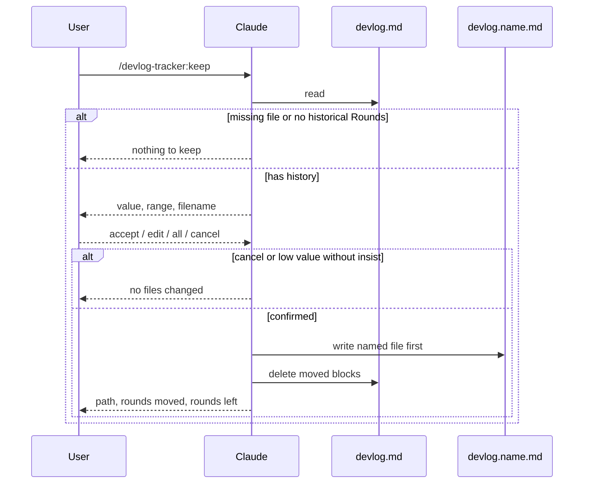

# Keep (named episode save)

`/devlog-tracker:keep` moves a contiguous stretch of history out of
`.devlog/devlog.md` into `.devlog/devlog.<name>.md` when that stretch is
worth keeping under a name. One command covers two user choices:

- **This episode** — Claude proposes a Round range from the file's
  content; the user may change the endpoints.
- **All history** — the range is every Round except the open keep turn;
  the working file restarts at Round 1.

The operation is always a **move**. The named file becomes the canonical
copy of those blocks; they are deleted from `devlog.md` after the named
file is written.

This is a slash command only. No new hooks. SessionStart still injects
only `.devlog/devlog.md`.

## Motivation

`/devlog-tracker:compact` is garbage collection: old `DONE` rounds append
onto one chronological dump, `devlog.archive.md`. A dump is the wrong
place for an episode the user may want to reopen later (a hard debug, a
design thread, a finished feature).

`keep` is the complementary action: take a themed stretch, give it a
filename derived from the content (or a name the user types), and get it
out of the rolling working log. Compact never reads or writes
`devlog.<name>.md` files. Keep never writes `devlog.archive.md`.

## Design constraint

Keep runs inside an ordinary interactive turn. `UserPromptSubmit` has
already appended a skeleton Round for the keep command itself. The
**open Round** is the `round` in `.devlog/.round-open` when that file
exists. If `.round-open` is missing (never started or paused), there is
no open Round and no keep-turn skeleton — every `## Round` in the file
is historical; do not treat the last Round as open for exclusion. When
judging `## ` headings, ignore lines inside fenced code blocks (```),
matching how the hook scripts parse. The open Round is **not** part of
any keep range. If the file has no historical Rounds besides that
skeleton, keep stops and does not create a named file.

Judging "worth keeping", proposing a range, and proposing a slug are
LLM work. They belong in `commands/keep.md`, the same way compact's
move rules live in `commands/compact.md`. Do not add a hook that tries
to detect a keep-worthy episode.

## Command flow

1. Read `.devlog/devlog.md`. If it is missing, or the only Round is the
   open keep skeleton, tell the user there is nothing to keep. Stop.
2. Assess whether the content (defaulting to the latest coherent episode,
   otherwise the whole history minus the open Round) is worth a named
   file. Signals are the same as the skill's "how detailed should this
   round be" table, applied to the stretch: file changes, decisions that
   affect later work, non-`DONE` / unfinished work, information that
   would be lost if the stretch disappeared into archive. Chatter,
   confirmations, and repeats are low value.
3. Reply once with: the value judgment, a proposed contiguous range
   (or all history), and a proposed filename. If value is low, lead
   with a recommendation not to keep, and still include the range and
   filename so the user can insist in one reply.
4. Wait. Do not write files yet.
5. On cancel, or on low value without an explicit insist, write nothing.
6. On confirm (accept / edit range / edit name / all history), validate
   the range and `<name>`, then move.

The keep turn itself still closes with `### Summary` / `### Handoff` /
`### Status` on the leftover open Round, or Stop will block as usual.



## Range

The range is a contiguous inclusive pair of existing Round numbers,
`from`–`to`, and **never includes the open keep Round**.

Claude proposes the latest stretch that reads as one piece of work,
using topic shifts in `### User Input` and `### Summary`. Propose the
full historical range only when the whole file is that one piece of
work. The user may change `from` / `to`, or say all history (every
Round except the open one).

Non-contiguous picks are out of scope. A range that is inverted, names
a Round that is not in the file, or includes the open keep Round is
rejected; ask again, write nothing.

Unfinished historical Rounds (`IN_PROGRESS`, `BLOCKED`, `INTERRUPTED`)
may be moved. Do not block keep on them.

### Full keep vs episode keep

**Full keep** is not a second code path. It is the case where the
confirmed range covers every historical Round in `devlog.md`.

| | Episode (some historical Rounds remain) | Full (none remain except the open keep Round) |
|---|---|---|
| Project summary (text before the first `## Round`) | stays in `devlog.md` | moves into the named file, after the provenance header |
| Round numbers in `devlog.md` | unchanged (gaps are allowed) | rewrite the leftover open Round heading to `## Round 1`, keep its timestamp and body |
| `.span-open` | delete only if its `round` is inside the moved range | delete |
| `.enabled` | unchanged | unchanged |
| `.round-open` | unchanged | set `"round"` to `1` (other fields unchanged; do not delete the file) |

The next Round number is still "last `## Round N` in `devlog.md`, plus
one". After a full keep that leftover heading is Round 1, so the
following turn is Round 2.

Do not renumber historical Rounds that stay in `devlog.md`. Compact
does not rewrite bodies; keep does not either, except that one heading
on a full keep.

### Checkpoints

A `## Checkpoint` block has a declared Round span in its heading
(e.g. `## Checkpoint（Round 10-20 摘要）`).

- Declared span fully inside `from`–`to` → move the block with the
  Rounds.
- Declared span fully outside → leave it in `devlog.md`.
- Declared span crosses the cut → leave it in `devlog.md`. Do not copy
  it into the named file.
- Heading has no parseable `Round X-Y` → fall back to document order:
  move the block only if it sits between the first moved `## Round`
  heading and the end of the last moved Round; otherwise leave it.

Full keep zeros `rounds_since_checkpoint` and does not change
`max_silent_rounds`. If Checkpoint headings leave `devlog.md`,
`enforce-devlog.sh` already resyncs `checkpoint_marker_count` downward
and does not treat that as "a new checkpoint was written".

## Filenames

Path: `.devlog/devlog.<name>.md`, same directory as `devlog.md` and
`devlog.archive.md`.

### Suggested `<name>`

Taken from the stretch that will move (not from leftover Rounds):
lowercase ASCII kebab-case, two to four segments, topic only. No date,
no `round-12-18` in the filename; the range belongs in the provenance
header.

Examples: `span-mode`, `summary-handoff`.

The first suggestion is always this ASCII slug. The user may replace it.

### Normalizing what the user types

Treat `foo`, `devlog.foo`, and `devlog.foo.md` as the same `<name>`
(`foo`): strip a leading `devlog.` and a trailing `.md` before the
other checks. Spaces become hyphens. Collapse repeated hyphens. Trim
leading and trailing hyphens.

Reject (ask again, write nothing) when the result is:

- empty, or would write `.devlog/devlog.md`
- `archive` (that file is compact's append target)
- contains `/`, `\`, or `..`
- longer than 64 characters

Unicode in a user-chosen `<name>` is allowed if it passes the checks
above.

### Collision

Never overwrite an existing `.devlog/devlog.<name>.md`. If it exists,
propose `devlog.<name>-2.md` (then `-3`, …) and wait for confirm or a
different name.

## Named file shape

Write the provenance header, then the moved blocks in their original
order and wording. Do not rewrite Round or Checkpoint bodies.

```markdown
# Kept log

- source: `.devlog/devlog.md`
- rounds: 12-18
- kept_at: <ISO 8601 timestamp with offset>

## Round 12 — <original heading rest>
...
```

On a full keep, the project summary (if any) sits after this header and
before the first `## Round`. `rounds` is the actual moved inclusive
range (the open keep Round is not in it).

## Write order and failures

1. Create the named file with the header plus moved blocks.
2. Confirm that file exists and contains those Round headings.
3. Delete the moved blocks from `devlog.md` (and apply the full-keep
   leftover heading rewrite, `.round-open` `"round"` → `1`, and
   `.span-open` delete when they apply).

Delete-first is forbidden: a crash between delete and write would drop
the episode. If step 1 fails, stop; `devlog.md` is unchanged. If step 3
fails after a successful write, tell the user both copies exist and do
not retry a delete blindly.

Other stops with no writes: missing file, no historical Rounds, cancel,
low value without insist, illegal range, illegal `<name>`.

Keep does not create `.devlog/` in a project that has no `devlog.md`.

## Boundary with compact and session start

| | `keep` | `compact` |
|---|---|---|
| Purpose | name and move a themed stretch (or all history) | append old `DONE` rounds to a dump |
| Target | `devlog.<name>.md` (one topic per file) | `devlog.archive.md` (append only) |
| Trigger | user command, confirm first | user command, then move |

Neither command touches the other's target files. SessionStart still
reads only `devlog.md`. `/devlog-tracker:continue` also reads only
`devlog.md` unless that last Handoff's 下一步 names a keep file.
Kept files live under `.devlog/`, so they follow the same gitignore
(or not) as the working log; this plugin does not add a separate
tracking path.

Keep is never auto-run.

## Known limitations

1. **Full keep and checkpoint counter** — Full keep zeros
   `rounds_since_checkpoint` and does not change `max_silent_rounds`.
2. **No `.enabled` / no open Round** — When `.enabled` is absent (never
   started or paused), there is no keep-turn skeleton and `.round-open`
   is missing. Keep must not fall back to treating the last historical
   Round as open; all Rounds in the file are eligible for the range.

## Testing

No new hook scripts, so no new hook self-checks. Correctness is the
command file, as with `compact`. The keep turn's own Round still has to
satisfy the existing Stop checks (`### Summary` and `### Handoff` on
the last Round).

## Files

| File | Role |
|---|---|
| `commands/keep.md` | Steps Claude runs on `/devlog-tracker:keep` |
| `commands/resume.md` | Reads a named keep file on explicit `/devlog-tracker:resume` |
| `skills/devlog-tracker/SKILL.md` | Short pointer: when keep exists, that it moves, that it is not compact |
| `README.md` | User-facing mention next to start / pause / compact |
| `.claude-plugin/plugin.json` | Plugin description lists keep |
| `.claude-plugin/marketplace.json` | Same description |
| `docs/design/keep.md` | This spec |

No hook or `hooks/hooks.json` changes.

## Non-goals

- Copy instead of move
- Non-contiguous Round sets
- A subdirectory for kept files
- Auto-prompting keep at the end of a valuable episode
- Reading or injecting kept files on SessionStart（只有明確執行 `/devlog-tracker:resume` 才讀）
- Pulling rounds back out of `devlog.archive.md`
- A second slash command for full keep
