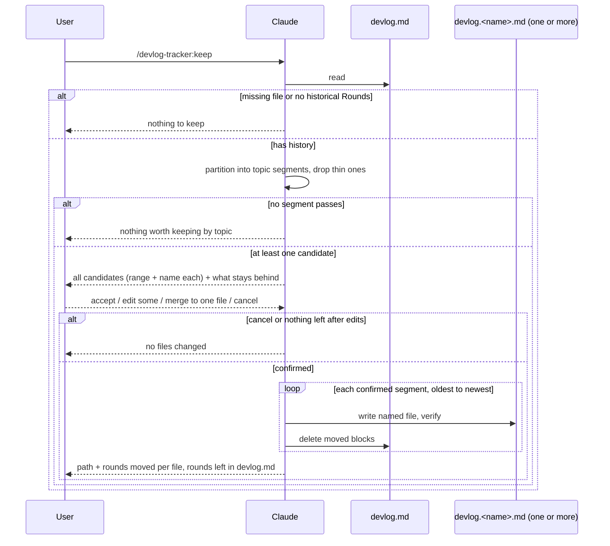

# Keep (named episode save)

`/devlog-tracker:keep` scans `.devlog/devlog.md`, splits its historical
Rounds into topic segments, and moves each segment worth keeping out
into its own `.devlog/devlog.<name>.md`. One command run can produce
several named files in one confirmation, one per topic.

- **Multiple topics** — Claude partitions every historical Round (all
  of `devlog.md` except the open Round) into contiguous topic
  segments, keeps only the ones worth naming, and proposes all of them
  at once. The user can accept everything, edit or drop individual
  segments, or fall back to one merged file.
- **All history, one file** — an explicit escape hatch: the user asks
  for the whole historical range as a single named file instead of a
  topic split.

The operation is always a **move**. Each named file becomes the
canonical copy of the blocks it received; those blocks are deleted
from `devlog.md` after the named file is written and verified.

This is a slash command only. No new hooks. SessionStart still injects
only `.devlog/devlog.md`. The underlying move primitive
(`hooks/scripts/keep-move.sh`) still only knows how to move one
contiguous range into one named file — `commands/keep.md` calls it
once per confirmed segment.

## Motivation

`/devlog-tracker:compact` is garbage collection: old `DONE` rounds append
onto one chronological dump, `devlog.archive.md`. A dump is the wrong
place for an episode the user may want to reopen later (a hard debug, a
design thread, a finished feature).

`keep` is the complementary action: take a themed stretch, give it a
filename derived from the content (or a name the user types), and get it
out of the rolling working log. Compact never reads or writes
`devlog.<name>.md` files. Keep never writes `devlog.archive.md`.

A working log accumulates more than one theme between keep runs. Only
proposing "the latest stretch" meant peeling off one topic per
invocation and re-running the command repeatedly to clear a file that
covers several finished threads. Scanning the whole file and proposing
every keep-worthy topic at once does that in one confirmation.

## Design constraint

Keep runs inside an ordinary interactive turn. `UserPromptSubmit` has
already appended a skeleton Round for the keep command itself. The
**open Round** is the `round` in `.devlog/.round-open` when that file
exists. If `.round-open` is missing (never started or paused), there is
no open Round and no keep-turn skeleton — every `## Round` in the file
is historical; do not treat the last Round as open for exclusion. When
judging `## ` headings, ignore lines inside fenced code blocks (```),
matching how the hook scripts parse. The open Round is **not** part of
any keep segment. If the file has no historical Rounds besides that
skeleton, keep stops and does not create a named file.

Judging "worth keeping", partitioning into segments, and proposing
slugs are LLM work. They belong in `commands/keep.md`, the same way
compact's move rules live in `commands/compact.md`. Do not add a hook
that tries to detect keep-worthy episodes. `keep-move.sh` stays a
single-range primitive; looping over segments is `commands/keep.md`'s
job, not the script's.

## Command flow

1. Read `.devlog/devlog.md`. If it is missing, or the only Round is the
   open keep skeleton, tell the user there is nothing to keep. Stop.
2. Partition every historical Round (all `## Round` headings except the
   open one) into contiguous, non-overlapping topic segments, oldest to
   newest, covering all of the history with no gaps at this stage —
   using the same topic-shift signal as before (`### User Input` /
   `### Summary` changes), just applied across the whole file instead
   of only the most recent stretch.
3. Assess each segment with the same "how detailed should this round
   be" signals as the skill uses: file changes, decisions that affect
   later work, non-`DONE` / unfinished work, information that would be
   lost if the segment disappeared into archive. A segment that is only
   chatter, confirmations, or repeats is dropped here — it is not
   listed and stays in `devlog.md` untouched. Segments that pass become
   candidates.
4. If no segment passes, tell the user there is nothing worth keeping
   by topic. Stop; write nothing.
5. Propose a filename for each candidate segment (see Filenames).
   Reply once with every candidate: its Round range, a one-line topic
   description, and its proposed filename, plus a short note on which
   Rounds are being left behind as too thin. Then stop and wait — do
   not write anything before the user responds.
6. On the user's reply, apply zero or more edits to the batch (range,
   name, or dropping a candidate — see Editing the batch), or accept a
   full-history-as-one-file override, or cancel.
7. On cancel, or no candidates survive the requested edits, write
   nothing.
8. Otherwise, validate the final set of segments (see Range and
   Filenames), then move each one in oldest-to-newest order (see
   Execution order and full keep).

The keep turn itself still closes with `### Summary` / `### Handoff` /
`### Status` on the leftover open Round, or Stop will block as usual.



## Editing the batch

The confirmation reply may combine any of:

- `採用` — write every proposed candidate as shown.
- `改第 N 段範圍 <from>-<to>` — change one candidate's range.
- `改第 N 段檔名 <name>` — change one candidate's filename.
- `移除第 N 段` — drop that candidate; its Rounds stay in `devlog.md`,
  untouched, available for a future keep run.
- `全部歷史合併成一個檔 <name>` — discard the topic split entirely and
  fall back to the pre-split behavior: every historical Round (still
  excluding the open Round) as a single named file. This is the only
  way to get one file covering multiple topics.
- `取消` — write nothing.

Numbering (`N`) refers to the candidate list as proposed; edits do not
renumber other candidates. Multiple edits in one reply are applied
before validation. Editing a range to reference a Round that isn't
historical, isn't in the file, or belongs to the open Round is
rejected the same way as an out-of-range single segment (see Range);
ask again, write nothing yet.

## Range

Each candidate's range is a contiguous inclusive pair of existing
Round numbers, `from`–`to`, and **never includes the open keep Round**.
This is unchanged from the single-segment design — what's new is that
one keep run now validates and moves a *list* of such ranges instead
of one.

Claude's initial partition covers all historical Rounds with no gaps
between candidates (every Round is in exactly one segment, whether or
not that segment survives the worth-keeping filter). After the user's
edits, the confirmed set of ranges may have gaps — Rounds inside a
dropped or never-proposed segment simply stay in `devlog.md`. The
confirmed ranges must not overlap each other and must not include the
open Round.

A range that is inverted, names a Round that is not in the file,
includes the open keep Round, or overlaps another confirmed segment's
range is rejected; ask again, write nothing.

Unfinished historical Rounds (`IN_PROGRESS`, `BLOCKED`, `INTERRUPTED`)
may be moved. Do not block keep on them.

### Full keep vs episode keep

**Full keep** is not a second code path. It is the case where a single
`keep-move.sh` invocation's range covers every historical Round still
in `devlog.md` at the time it runs (see Execution order and full keep
for how this can happen inside a multi-segment batch).

| | Episode (some historical Rounds remain after this move) | Full (none remain except the open keep Round) |
|---|---|---|
| Project summary (text before the first `## Round`) | stays in `devlog.md` | moves into the named file, after the provenance header |
| Round numbers in `devlog.md` | unchanged (gaps are allowed) | rewrite the leftover open Round heading to `## Round 1`, keep its timestamp and body |
| `.span-open` | delete only if its `round` is inside the moved range | delete |
| `.enabled` | unchanged | unchanged |
| `.round-open` | unchanged | set `"round"` to `1` (other fields unchanged; do not delete the file) |

The next Round number is still "last `## Round N` in `devlog.md`, plus
one". After a full keep that leftover heading is Round 1, so the
following turn is Round 2.

Do not renumber historical Rounds that stay in `devlog.md`. Compact
does not rewrite bodies; keep does not either, except that one heading
on a full keep.

### Checkpoints

A `## Checkpoint` block has a declared Round span in its heading
(e.g. `## Checkpoint（Round 10-20 摘要）`). This applies per segment,
independently, each time `keep-move.sh` runs:

- Declared span fully inside that segment's `from`–`to` → move the
  block with the Rounds.
- Declared span fully outside → leave it in `devlog.md`.
- Declared span crosses the cut → leave it in `devlog.md`. Do not copy
  it into the named file.
- Heading has no parseable `Round X-Y` → fall back to document order:
  move the block only if it sits between the first moved `## Round`
  heading and the end of the last moved Round; otherwise leave it.

Full keep zeros `rounds_since_checkpoint` and does not change
`max_silent_rounds`. If Checkpoint headings leave `devlog.md`,
`enforce-devlog.sh` already resyncs `checkpoint_marker_count` downward
and does not treat that as "a new checkpoint was written".

## Execution order and full keep

`commands/keep.md` runs `keep-move.sh` once per confirmed segment, in
ascending Round order (the oldest confirmed segment first). Each
invocation only knows about its own `--from`/`--to`/`--name`; it has no
notion of "batch" and does not change.

Because segments dropped as too-thin generally stay behind, most batch
runs never reach the full-keep case. But if the confirmed segments
happen to cover every remaining historical Round with no gaps, the
*last* invocation in the sequence will see `moved == historical` and
trigger `keep-move.sh`'s existing full-keep behavior — project summary
into that file, open Round renumbered to 1 — exactly as it would for a
single full keep. Processing oldest-to-newest means this is always the
chronologically last segment, matching what a user would expect if
"everything got kept." This is intentional: batching does not get a
separate full-keep rule, it just runs the same primitive enough times
that the primitive's own full-keep detection can fire on the final
call.

If an earlier invocation in the sequence fails (`keep-move.sh` exits
1), stop immediately: show its stderr as-is, do not retry or hand-roll
the move, and do not run the remaining queued segments. Report which
segments already moved (with their file paths) and which were not
attempted, so the user knows `devlog.md`'s exact state.

## Filenames

Path: `.devlog/devlog.<name>.md`, same directory as `devlog.md` and
`devlog.archive.md`.

### Suggested `<name>`

Taken from the segment that will move (not from leftover Rounds):
lowercase ASCII kebab-case, two to four segments, topic only. No date,
no `round-12-18` in the filename; the range belongs in the provenance
header.

Examples: `span-mode`, `summary-handoff`.

The first suggestion is always this ASCII slug. The user may replace
it. When a batch's initial partition happens to suggest the same slug
for two different segments, disambiguate before showing them to the
user the same way an on-disk collision is handled (see Collision).

### Normalizing what the user types

Treat `foo`, `devlog.foo`, and `devlog.foo.md` as the same `<name>`
(`foo`): strip a leading `devlog.` and a trailing `.md` before the
other checks. Spaces become hyphens. Collapse repeated hyphens. Trim
leading and trailing hyphens.

Reject (ask again, write nothing) when the result is:

- empty, or would write `.devlog/devlog.md`
- `archive` (that file is compact's append target)
- contains `/`, `\`, or `..`
- longer than 64 characters

Unicode in a user-chosen `<name>` is allowed if it passes the checks
above.

### Collision

Never overwrite an existing `.devlog/devlog.<name>.md`. If it exists —
or if another segment in the same confirmed batch already claimed that
name — propose `devlog.<name>-2.md` (then `-3`, …) and wait for confirm
or a different name. Check on-disk collisions and within-batch
collisions together; a batch never produces two segments destined for
the same path.

## Named file shape

Write the provenance header, then the moved blocks in their original
order and wording. Do not rewrite Round or Checkpoint bodies.

```markdown
# Kept log

- source: `.devlog/devlog.md`
- rounds: 12-18
- kept_at: <ISO 8601 timestamp with offset>

## Round 12 — <original heading rest>
...
```

On a full keep, the project summary (if any) sits after this header and
before the first `## Round`. `rounds` is the actual moved inclusive
range (the open keep Round is not in it). In a multi-file batch, the
project summary can only land in the one segment that ends up
triggering full keep (see Execution order and full keep); every other
named file's header carries only its own range.

## Kept index

Every `keep-move.sh` invocation, episode or full, leaves a discovery
pointer behind in `devlog.md` — the point of `keep` is to get content
*out* of the working log, but "which file did that topic go to" still
needs to be findable without opening every `devlog.<name>.md`.

After deleting the moved blocks, `keep-move.sh` strips any existing
trailing `## Kept 索引` block from `devlog.md`, then re-appends it with
one line added:

```markdown
## Kept 索引
- `devlog.<name>.md`：Round <from>-<to>，kept_at <ISO 8601 timestamp>
```

- **Always rebuilt, never duplicated.** Each run strips the old block
  and reprints every existing line plus the new one, so there is only
  ever one `## Kept 索引` heading in `devlog.md`, always at the end,
  in the order files were kept.
- **One line per named file**, not per keep run — a batch that keeps
  three files in one confirmation adds three lines.
- **Not reconciled with the filesystem.** If a `devlog.<name>.md` is
  later deleted by hand, its index line is not removed automatically —
  a ghost row is a known limitation, not a bug to fix here.
- **SessionStart surfaces this block, not the named files' content.**
  `hooks/scripts/session-start-devlog.sh` includes the current
  `## Kept 索引` in the startup/resume/compact/fork excerpt so the next
  Claude knows a topic was kept and which file to `/devlog-tracker:resume`
  it from, without ever auto-injecting a keep file's body.
- **Full keep still gets an index line.** Even though a full keep
  empties out the historical Rounds and renumbers the leftover open
  Round to 1, the `## Kept 索引` block (rebuilt from the pre-move
  content) is preserved on the new `## Round 1`, not dropped.

## Write order and failures

For each confirmed segment, in order (see Execution order and full
keep):

1. Create the named file with the header plus moved blocks.
2. Confirm that file exists and contains those Round headings.
3. Delete the moved blocks from `devlog.md` (and apply the full-keep
   leftover heading rewrite, `.round-open` `"round"` → `1`, and
   `.span-open` delete when they apply to this segment).

Delete-first is forbidden: a crash between delete and write would drop
the episode. If step 1 fails for a segment, stop the whole batch;
`devlog.md` is unchanged for that segment and any segments after it in
the sequence are not attempted. If step 3 fails after a successful
write for a segment, tell the user both copies exist for that segment
and do not retry a delete blindly; still stop the remaining queued
segments.

Other stops with no writes at all: missing file, no historical Rounds,
no candidate segment worth keeping, cancel, illegal range, illegal
`<name>`.

Keep does not create `.devlog/` in a project that has no `devlog.md`.

## Boundary with compact and session start

| | `keep` | `compact` |
|---|---|---|
| Purpose | name and move one or more themed stretches (or all history) | append old `DONE` rounds to a dump |
| Target | `devlog.<name>.md` (one topic per file) | `devlog.archive.md` (append only) |
| Trigger | user command, confirm first | user command, then move |

Neither command touches the other's target files. SessionStart still
reads only `devlog.md`. `/devlog-tracker:continue` also reads only
`devlog.md` unless that last Handoff's 下一步 names a keep file.
Kept files live under `.devlog/`, so they follow the same gitignore
(or not) as the working log; this plugin does not add a separate
tracking path.

Keep is never auto-run.

## Known limitations

1. **Full keep and checkpoint counter** — Full keep zeros
   `rounds_since_checkpoint` and does not change `max_silent_rounds`.
2. **No `.enabled` / no open Round** — When `.enabled` is absent (never
   started or paused), there is no keep-turn skeleton and `.round-open`
   is missing. Keep must not fall back to treating the last historical
   Round as open; all Rounds in the file are eligible for partitioning.
3. **Which segment gets full keep is a side effect of ordering** — When
   a batch happens to cover all of history, the project summary and the
   Round-1 renumbering land on whichever segment is chronologically
   last, purely because segments run oldest-to-newest. There is no
   separate rule the user can use to pick a different destination for
   the project summary in that case.
4. **A dropped-then-wanted segment needs a second run** — a segment the
   partition filtered out as too thin is never offered in the batch; if
   the user wants it kept anyway, that is a separate, later
   `/devlog-tracker:keep` invocation (it will very likely be filtered
   out again unless the file around it changed), not an option inside
   this batch's edit grammar.

## Testing

`hooks/scripts/keep-move.sh` has `hooks/scripts/test-keep-move.sh`
(assert-and-exit). Topic-split *judgment* still lives in
`commands/keep.md` (LLM steps); the script only moves contiguous
ranges after confirm. The keep turn's own Round still has to satisfy
Stop (`### Summary` / `### Handoff` / Status rules).

## Files

| File | Role |
|---|---|
| `commands/keep.md` | Steps Claude runs on `/devlog-tracker:keep` |
| `commands/resume.md` | Reads a named keep file on explicit `/devlog-tracker:resume` |
| `hooks/scripts/keep-move.sh` | Moves contiguous Round/Checkpoint ranges after confirm; rebuilds `## Kept 索引` |
| `hooks/scripts/test-keep-move.sh` | Self-check for `keep-move.sh` |
| `hooks/scripts/session-start-devlog.sh` | Surfaces `## Kept 索引` in the startup/resume/compact/fork excerpt |
| `skills/devlog-tracker/SKILL.md` | Short pointer: when keep exists, that it moves, that it is not compact, that it can split by topic |
| `README.md` | User-facing mention next to start / pause / compact |
| `.claude-plugin/plugin.json` | Plugin description lists keep |
| `.claude-plugin/marketplace.json` | Same description |
| `docs/design/keep.md` | This spec |

No `hooks/hooks.json` changes (user-invoked script only).

## Non-goals

- Copy instead of move
- A single named file spanning non-contiguous Rounds (each named file
  is still one contiguous range; a batch run achieving several files
  is not the same thing — see Range)
- A subdirectory for kept files
- Auto-prompting keep at the end of a valuable episode
- Reading or injecting kept files on SessionStart（只有明確執行 `/devlog-tracker:resume` 才讀）
- Pulling rounds back out of `devlog.archive.md`
- A second slash command for full keep
- Rolling back an already-written segment if a later segment in the
  same batch fails (see Write order and failures)
