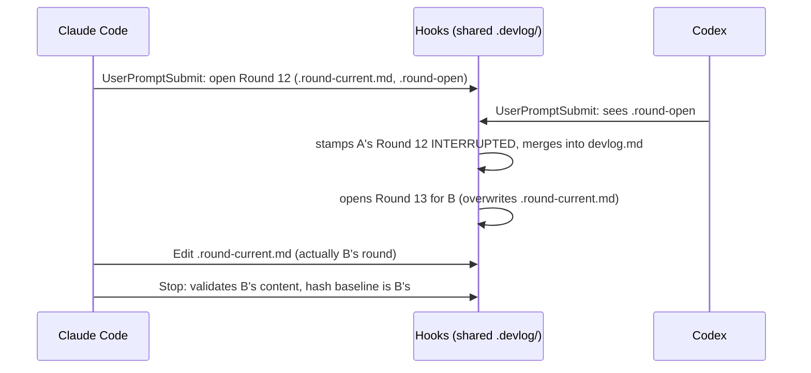

# Multi-platform concurrency (same worktree)

Lets Claude Code, Codex, and Cursor run devlog-tracker **at the same time
in the same worktree** without corrupting each other's rounds. Status:
implemented. Plan:
`multi-platform-concurrency-plan.md`.

## Problem

`.devlog/.lock` already serializes every hook script's write, so no single
file write is torn. The corruption comes from the per-round *hot state*
being one shared copy per project:

Also: both sides number the next round from `devlog.md`'s max, so two
rounds opened close together get the same number; `handoff.md` is
last-writer-wins, so one platform's Stop erases the other's Session
Handoff (previously listed as a Known limitation in
`session-handoff-file.md`).

## Decisions

Settled interactively before writing this doc:

1. **Scope: different platforms, same worktree.** Two Claude Code windows
   in one worktree, parallel subagents, and cross-worktree coordination
   are out of scope.
2. **Key hot state by platform, not session.** Adapters always know
   which platform they are; platforms' `session_id`s are inconsistent
   (and Cursor's is not always forwarded).
3. **One shared `devlog.md`, rounds interleaved in close order.** Round
   numbers are reserved at open time under the lock, so they are unique
   (not necessarily in file order). Non-Claude headings record their
   source.
4. **Session Handoff is per platform.** SessionStart injects only its own
   platform's handoff, plus a one-line notice when another platform has
   an unfinished one.
5. **Workspace-mismatch backstop keeps firing** on changes made by the
   other platform (it is a real external change); the notice only gains
   a hint that it may come from another platform.

Rejected: serializing whole rounds with the lock (a round lasts minutes;
the lock fails open after 2s, so it degrades back to today's corruption,
and hard-blocking would freeze the user); one devlog file per platform
(user chose a single interleaved history).

## Platform identity

New env var `DEVLOG_PLATFORM`, validated by one helper
(`devlog_platform` in `devlog-path.sh`): `claude`, `codex`, or `cursor`;
anything else (including unset) is `claude`.

| Caller | Value |
|---|---|
| `codex/hooks/*.sh` | exports `codex` next to `DEVLOG_PROJECT_DIR` |
| `cursor/hooks/*.sh` | exports `cursor` next to `DEVLOG_PROJECT_DIR` |
| `claude/hooks.json` (unchanged) | unset → `claude` |

LLM-invoked scripts that act on *one* platform's round (`await-open.sh`,
`span-open.sh`, `span-close.sh`) get it from the command line: their docs
prefix
`DEVLOG_PLATFORM="<你所在的平台：claude／codex／cursor>"`. A missing
prefix degrades to `claude`, same as today's single-slot behavior.

## State layout

**Claude keeps today's file names; other platforms add `@
`.** `@`
never appears in a sanitized branch segment (`[A-Za-z0-9._-]`), so
`handoff.codex.md` (branch `codex`) and `handoff@codex.md` (platform
Codex on main) cannot collide.

| Per platform (Claude name → other platform name) | Stays shared |
|---|---|
| `.round-current.md` → `.round-current@
.md` | `.enabled` |
| `.round-open` → `.round-open@
` | `devlog[.<b>].md` |
| `.turn-start` → `.turn-start@
` | `.checkpoint-state` |
| `.segment-state` → `.segment-state@
` | `.lessons-*` |
| `.awaiting-reply` → `.awaiting-reply@
` | `.lock` |
| `.interrupted` → `.interrupted@
` | |
| `.span-open` → `.span-open@
` | |
| `.workspace-mismatch` → `.workspace-mismatch@
` | |
| `handoff[.<b>].md` → `handoff[.<b>]@
.md` | |

`devlog_resolve_paths` exports all of these as variables (`ROUND_CURRENT`,
`ROUND_OPEN`, `TURN_MARKER`, `SEGMENT_FILE`, `AWAITING_FILE`,
`INTERRUPTED_FLAG`, `SPAN_FILE`, `MISMATCH_FILE`, `HANDOFF_FILE`); no
script builds these paths itself any more.

**Legacy claim.** Before this change every platform wrote Claude's names.
The first time any platform resolves after upgrade (with `.enabled`
present, under the lock), `.devlog/.platform-claimed` is written. If that
first platform is not Claude, it renames every existing Claude-named
per-platform file to its own `@
` name first — the platform that runs
first after upgrade most likely wrote them, so a Codex-only user keeps
their open round and handoff. If Claude is first, nothing moves. After
the marker exists, nothing is ever claimed again.

**Segment Watch config.** `start-devlog.sh` still creates only
`.segment-state`. The first round of a non-Claude platform seeds
`.segment-state@
` from it (same `max_silent_seconds`, fresh counters).
`segment-watch-set.sh` writes the threshold into every platform's file —
it is a project setting, not round state.

**Branch-tail migration** (`_devlog_migrate_unfinished_tail`) moves every
platform's handoff (`handoff.md`, `handoff@*.md`) to the branch names.

## Round numbering and heading

Numbers are **reserved at open time**, under the lock (`round-start.sh`
already holds it for its whole body):

- next = max(max `## Round N` in `devlog.md`, the `round` of every
  platform's `.round-open*` marker whose `file` field names this devlog
  file) + 1.
- Claude writes `## Round <next> — <timestamp>` (unchanged); other
  platforms write `## Round <next> — <timestamp> · 
`.
- Numbers are unique but **not necessarily in file order**: if Round 14
  closes before Round 13, it is appended first. Consumers already
  tolerate this — `LAST_N` takes the max, `devlog_list_round_starts`'s
  "last" means last in file, timeline and keep-all sort by timestamp.
- **Span exception: renumber at merge.** Rounds the LLM opens itself
  inside a Span (no `round-start.sh`, no `.round-open*`) take max+1 from
  `devlog.md` and so can collide with another platform's reservation.
  `devlog_merge_round_current` (every merge path: Stop, dangling close,
  orphan rescue; all under the lock) first rewrites each `## Round N`
  heading in the round file whose N is already a round in the target
  devlog, reserved by another platform's `.round-open*` for that file, or
  repeated in the same merge, to the next free number (above all of
  those), and appends ` · 
` to a non-Claude heading without an owner
  suffix. The caller's own reserved number passes through unchanged
  (a reserved round never collides; a Reply Fold reopening a duplicate
  pre-upgrade number keeps it). Markers that stored the old number are not
  rewritten: `.span-open*` holds the reserved round that opened the span,
  and `await-open.sh` without `.round-open*` names a round already in
  `devlog.md`, so neither points at a renumbered span round.
- Heading parsers take only the digits after `## Round `
  (`report-scan.awk`, `keep-all.js`, `keep-move.sh`, `clean-devlog.sh`,
  `devlog_list_round_starts`). Timeline's time text becomes
  `<timestamp> · 
`, which still sorts by timestamp; no change needed.

Rejected: assigning at merge with a `## Round ?` placeholder. Every
reader of the number (`close-open-round.sh` drops non-numeric
`.round-open` markers — silently losing the round; `segment-watch.sh`,
`clean-devlog.sh`, `handoff-convert.sh` match `## Round [0-9]+`;
`await-open.sh` needs the number before the merge) would need a special
case.

## "Last round" becomes "my platform's last round"

A round belongs to platform `p` when its heading ends in ` · 
`;
a heading with no ` · <word>` suffix belongs to `claude` (this covers all
pre-upgrade history). These places switch from `devlog.md`'s last round
to the caller's own last round:

- Reply Fold detection in `round-start.sh`: the awaited round must still
  exist in `devlog.md` **by number**; `devlog_reopen_last_round` becomes
  `devlog_reopen_round <devlog> <current> <n> [platform]`, which cuts that
  numbered block out of anywhere in the file. With duplicate numbers
  (pre-upgrade collisions) the caller's own heading wins; any owner's is
  the fallback (a pre-claim heading the platform wrote unsuffixed —
  `devlog_fold_round_start`). The merge re-appends it at the tail with its
  original number.
- Task-notification fold target.
- Workspace-mismatch claim (`workspace_claim_state` gains a platform
  argument) and the Lessons BLOCKED→unblocked advisory.
- `await-open.sh` / `span-open.sh` fallback when `.round-open*` is
  missing.

SessionStart's history excerpt stays project-wide (last two rounds of
any platform — headings show the source); checkpoint counting stays
project-wide.

## Commands that act on every platform

- `pause-devlog.sh` removes every platform's markers.
- `clean-devlog.sh`, `keep-move.sh`, `keep-all.sh` look at every
  platform's `.round-open*`. With zero or one open round they behave as
  today (operating on that platform's files). With two or more they
  refuse: `其他平台還有進行中的輪次（<platforms>），等它們收尾再執行。`
- `clean-devlog.sh` removes every platform's handoff for the branch.
- `migrate-handoff.sh` also scans `.round-current@*.md` and
  `handoff*@*.md`.
- `status-devlog.sh` stays single-platform (caller's own span / segment
  state).

## Session Handoff

- Stop writes/removes only `$HANDOFF_FILE` (the caller's).
- SessionStart prints the caller's file. For each *other* platform's
  non-empty handoff on the same branch it prints one line:
  `另一個平台（<q>）有未完成的交接：.devlog/<file>`.

## LLM-facing changes

- `round-start.sh` prints `這一輪寫在 .devlog/<round file>。` for non-Claude
  platforms (Claude keeps today's silent default).
- Stop/Segment Watch/mismatch messages use `${ROUND_CURRENT##*/}` instead
  of the literal `.round-current.md`.
- `skills/devlog-tracker/SKILL.md` and references (`contract.md`,
  `round-segments.md`, `reply-fold.md`) say: Claude Code writes
  `.round-current.md`; Codex/Cursor write `.round-current@codex.md` /
  `.round-current@cursor.md` (hook messages name the exact file). Then
  run `node scripts/sync-codex-plugin.js`.
- Segment Watch / mismatch allowlists (`segment-watch.sh`,
  `codex/hooks/on-pre-tool.sh`) accept only the caller's own round file.
- Workspace-mismatch notice appends
  `（若同一工作樹還有其他平台在跑，差異可能來自它。）`.

## Out of scope

- Multiple sessions of the same platform in one worktree (they still
  share one platform slot, same as today).
- Cross-worktree coordination.
- Timeline/report UI for the source (shown as part of the time text).

## Testing

TDD, in `core/scripts/tests/` plus both `test-adapters.sh`:

| Test | Covers |
|---|---|
| `test-devlog-path.sh` | `devlog_platform` default/invalid; per-platform paths on main/branch; legacy claim by first non-Claude platform; Claude-first claims nothing; marker stops later claims; branch tail moves `handoff@*.md` |
| `test-devlog-md.sh` | `devlog_round_platform`; `devlog_last_round_start_of`; `devlog_round_start_by_number`; `devlog_reopen_round` cuts a middle block |
| `test-multi-platform.sh` (new) | the diagram's interleave: claude opens, codex opens, both Stop in either order → two distinct numbers, each with its own content, neither INTERRUPTED; codex handoff and claude handoff coexist; clean refuses with two open rounds |
| `test-round-start.sh` | codex heading suffix + file notice; reservation skips another platform's open number |
| `test-await-open.sh` | Reply Fold on codex's round after claude merged a later round |
| `test-session-start-devlog.sh` | own handoff injected; other platform's one-line notice |
| `codex/hooks/test-adapters.sh`, `cursor/hooks/test-adapters.sh` | adapters write `@codex` / `@cursor` files; allowlist accepts own file, rejects Claude's |
