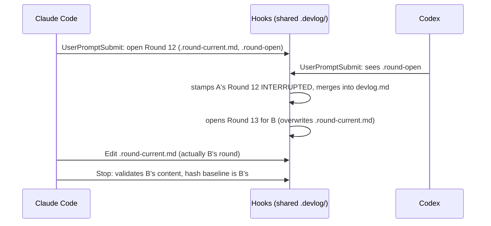

# Multi-platform concurrency (same worktree)

Lets Claude Code, Codex, and Cursor run devlog-tracker **at the same time
in the same worktree** without corrupting each other's rounds. Status:
design approved, not yet implemented.

## Problem

`.devlog/.lock` already serializes every hook script's write, so no single
file write is torn. The corruption comes from the per-round *hot state*
being one shared copy per project:

Also: both sides number the next round from `devlog.md`'s max, so two
rounds opened close together get the same number; `handoff.md` is
last-writer-wins, so one platform's Stop erases the other's Session
Handoff (previously listed as a Known limitation in
`session-handoff-file.md`).

## Decisions

Settled interactively before writing this doc:

1. **Scope: different platforms, same worktree.** Two Claude Code windows
   in one worktree, parallel subagents, and cross-worktree coordination
   are out of scope.
2. **Key hot state by platform, not session.** Adapters always know
   which platform they are; platforms' `session_id`s are inconsistent
   (and Cursor's is not always forwarded).
3. **One shared `devlog.md`, rounds interleaved in close order.** Round
   numbers are assigned at merge time, under the lock, so they are
   unique and monotonic in file order. Each heading records its source.
4. **Session Handoff is per platform.** SessionStart injects only its own
   platform's handoff, plus a one-line notice when another platform has
   an unfinished one.
5. **Workspace-mismatch backstop keeps firing** on changes made by the
   other platform (it is a real external change); the notice only gains
   a hint that it may come from another platform.

Rejected: serializing whole rounds with the lock (a round lasts minutes;
the lock fails open after 2s, so it degrades back to today's corruption,
and hard-blocking would freeze the user); one devlog file per platform
(user chose a single interleaved history).

## Platform identity

New env var `DEVLOG_PLATFORM`, read by every core script through one
helper (`devlog_platform` in `devlog-path.sh`):

| Caller | Value |
|---|---|
| `codex/hooks/*.sh` | exports `codex` |
| `cursor/hooks/*.sh` | exports `cursor` |
| `claude/hooks.json` (unchanged) | unset → defaults to `claude` |

Commands run by the LLM (`await-open.sh`, `span-open.sh`,
`segment-watch-set.sh`, …) get the platform the same way; the skill text
tells Codex/Cursor to prefix `DEVLOG_PLATFORM=<platform>`, and Claude
needs nothing. Values outside `[a-z]+` fall back to `claude`.

## State layout

`devlog_resolve_paths` additionally sets platform-scoped paths. `
` is
the platform; `<b>` the existing branch segment (absent on main).

| Per platform | Stays shared |
|---|---|
| `.round-current.
.md` | `.enabled` |
| `.round-open.
` | `devlog[.<b>].md` |
| `.turn-start.
` | `.checkpoint-state` |
| `.segment-state.
` | `.lessons-*` |
| `.awaiting-reply.
` | `.lock` |
| `.interrupted.
` | |
| `.span-open.
` | |
| `.workspace-mismatch.
` | |
| `handoff[.<b>].
.md` | |

**Legacy migration.** On first resolve after upgrade (under the lock), an
existing un-suffixed file (`.round-current.md`, `.round-open`,
`handoff.md`, …) is renamed to the name of the platform whose hook is
resolving — the platform that runs first after upgrade is the one most
likely to have written it (a Codex-only user keeps their handoff). Done
once; the un-suffixed names are never written again. If two platforms
were already running concurrently before the upgrade, the old state was
already mixed, and attributing it to whichever resolves first is no
worse.

## Round numbering and heading

- `round-start.sh` writes the skeleton heading as
  `## Round ? — <timestamp> · 
` and records `"round": null` in
  `.round-open.
`.
- `devlog_merge_round_current` (called by Stop and `close-open-round.sh`,
  already under the lock) reads `devlog.md`'s max number, replaces `?`
  with `max + 1`, then appends. A reopened round (below) keeps its number.
- If `.awaiting-reply.
` holds `"round": null`, the merge rewrites it
  to the assigned number in the same locked step.
- Heading parsers already take only the digits after `## Round `
  (`report-scan.awk`, `keep-all.js`, `keep-move.sh`, `clean-devlog.sh`,
  `devlog_list_round_starts`). `timeline-render.js` must strip the
  trailing ` · 
` from the timestamp and show it as a badge.
- Old headings without ` · 
` stay valid everywhere and read as
  source unknown.

Validation in `enforce-devlog.sh` only needs a `## Round ` line, so `?`
passes unchanged.

## "Last round" becomes "my platform's last round"

These places currently read `devlog.md`'s last round and must instead
read the last round whose heading ends in ` · 
` (falling back to the
last un-suffixed round for `claude`):

- Reply Fold detection in `round-start.sh`, and
  `devlog_reopen_last_round` → becomes `devlog_reopen_round <n>`, which
  cuts that numbered block out of anywhere in `devlog.md`; the merge
  re-appends it at the tail with its original number.
- Task-notification fold target.
- Workspace-mismatch claim (`workspace_claim_state`).
- Lessons BLOCKED→unblocked advisory.
- `await-open.sh` fallback when `.round-open.
` is missing.
- `session-start-devlog.sh` excerpt and the open-round dump.

Checkpoint counting stays project-wide.

## Session Handoff

- Stop writes/removes `handoff[.<b>].
.md` only.
- SessionStart prints its own platform's file. For each *other*
  platform's non-empty handoff on the same branch it prints one line:
  `另一個平台（<q>）有未完成的交接：<path>`.
- `/clean` removes all platforms' handoffs; `/migrate` handles
  `handoff[.<b>].
.md`.

## LLM-facing changes

- `round-start.sh`'s context output always names the round file:
  `這一輪寫在 .devlog/.round-current.
.md`.
- `skills/devlog-tracker/SKILL.md` and references (`contract.md`,
  `round-segments.md`, `reply-fold.md`) describe the rule
  `.round-current.<你的平台>.md` instead of the fixed name; then run
  `node scripts/sync-codex-plugin.js`.
- Segment Watch / mismatch allowlists (`segment-watch.sh`,
  `codex/hooks/on-pre-tool.sh`) accept only the caller's own
  `.round-current.
.md`.
- Workspace-mismatch notice appends
  `（若同一工作樹還有其他平台在跑，差異可能來自它。）`.

## Out of scope

- Multiple sessions of the same platform in one worktree (they still
  share one platform slot, same as today).
- Coordinating `/compact`, `/keep`, `/clean` with another platform's open
  round beyond the existing lock — they only rewrite `devlog.md` and
  never touch another platform's `.round-current.
.md`.
- Cross-worktree coordination.

## Testing

TDD, in `core/scripts/tests/` plus both `test-adapters.sh`:

| Test | Covers |
|---|---|
| `test-devlog-path.sh` | `DEVLOG_PLATFORM` default/invalid; per-platform paths on main/branch; one-time legacy rename to the resolving platform |
| `test-round-start.sh` | skeleton `## Round ? — … · 
`; `.round-open.
` null round; another platform's open round is **not** closed |
| `test-devlog-md.sh` | merge assigns `max+1`; reopened round keeps number; `devlog_reopen_round` cuts a middle block |
| `test-multi-platform.sh` (new) | interleave scenario from the diagram: claude opens, codex opens, both Stop in either order → two distinct numbered rounds, each with its own content, neither INTERRUPTED |
| `test-await-open.sh` | null round rewritten at merge; Reply Fold on own platform's round when the other platform merged after it |
| `test-enforce-devlog-session-handoff.sh` | per-platform handoff write/remove |
| `test-session-start-devlog.sh` | own handoff injected; other platform's one-line notice |
| `test-segment-watch.sh`, `codex/hooks/test-adapters.sh` | allowlist accepts own file, rejects other platform's |
| `timeline-render.test.js` | ` · 
` suffix parsed into a badge |
